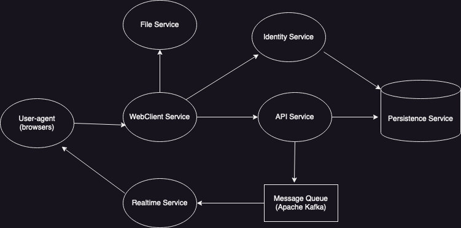

<h1><a id="top" href="#top">Slack-Clone Design</a></h1>

<ul>
    <li><a href="#overview">Overview</a></li>
    <li><a href="#stack">Stack</a></li>
    <li><a href="#services">Services</a></li>
    <li>
        <a href="#database-schema">Database Schema (Database Service)</a>
        <ul>
            <li><a href="#database-entities">Entities</a></li>
            <li><a href="#mask-defs">Bit Mask/Enum Definitions</a></li>
            <li><a href="#database-preloaded-rows">Preloaded Rows</a></li>
        </ul>
    </li>
    <li>
        <a href="#graphql-schema">GraphQL Schema (API Service)</a>
        <ul>
            <li><a href="#graphql-queries">Queries</a></li>
            <li><a href="#graphql-mutations">Mutations</a></li>
            <li><a href="#graphql-types">Types</a></li>
        </ul>
    </li>
    <li>
        <a href="#ui">React App UI (WebClient Service)</a>
    </li>
    <li>
        <a href="#implementation">Implementation Plan</a>
    </li>
</ul>
<hr>

<h1><a id="overview" href="#overview">Overview</a></h1>
<h4>Features</h4>
<ul>
    <li>Real-time messaging and notifications</li>
    <li>OICD/OAuth2 authentication and authorization</li>
    <li>File uploads</li>
    <li>Markdown support</li>
    <li>Workspaces</li>
    <li>Channels (within workspaces)</li>
    <li>Direct messages</li>
    <li>Privacy, administrative, profile, and notification settings</li>
    <li>Mentions and message reactions</li>
    <li>Search workspace for channels, messages, reactions, and more</li>
    <li>GraphQL API</li>
</ul>

<h4>Services</h4>

<ul>
    <li>Identity Service - authenticates users and issues resource access tokens</li>
    <li>WebClient Service - serves bundled, code-split React UI</li>
    <li>API Service - serves non-realtime data to authenticated clients (i.e., React UI served by WebClient)</li>
    <li>Realtime Service - handles streaming of realtime data to authenticated clients</li>
    <li>File Service - handles storage of images and other files</li>
    <li>Persistence Service - the database server backing the Identity, API, Realtime, and File services</li>
</ul>
</p>

<h4>Motivation</h4>
<ul>
    <li>Improve C#/.NET/ASP.NET skills</li>
    <li>Understand and implement best practice auth patterns</li>
    <li>Improve GraphQL skills, try out Relay</li>
    <li>Design a non-trivial API and underlying data model</li>
    <li>Improve working knowledge of webpack</li>
    <li>Maintain React skills</li>
    <li>Experiment with realtime functionality</li>
</ul>
<hr>

<h1><a id="stack" href="#stack">Stack</a></h1>
<ul>
    <li><a href="https://learn.microsoft.com/en-us/aspnet/core/introduction-to-aspnet-core?view=aspnetcore-7.0">ASP.NET Core (6.0)</a> - API Service, Identity Service, File Service, Realtime Service, WebClient Service</li>
    <ul>
        <li><a href="https://learn.microsoft.com/en-us/aspnet/core/introduction-to-aspnet-core?view=aspnetcore-7.0">ASP.NET Core SignalR (2.4)</a> - Realtime Service</li>
        <li><a href="https://docs.confluent.io/kafka-clients/dotnet/current/overview.html">confluent-kafka-dotnet (2.1)</a> - Realtime Service, API Service</li>
    </ul>
    <li><a href="https://kafka.apache.org/intro">Apache Kafka</a> - API Service, Realtime Service</li>
    <li><a href="https://docs.duendesoftware.com/identityserver/v6/">Duende Identity Server (6.3)</a> - Identity Service</li>
        <ul>
            <li><a href="https://docs.duendesoftware.com/identityserver/v6/bff/">Duende.BFF (2.0)</a> - WebClient Service</li>
        </ul>
    <li><a href="https://learn.microsoft.com/en-us/ef/core/">Entity Framework Core (7.0)</a> - API Service, Identity Service, File Service, Realtime Service</li>
    <li>
        <a href="https://graphql.org/">GraphQL</a>
        <ul>
            <li><a href="https://relay.dev/">Relay (15.0)</a> - WebClient Service</li>
            <li><a href="https://graphql-dotnet.github.io/">GraphQL .NET (7.5)</a> - API Service</li>
        </ul>
    </li>
    <li><a href="https://www.postgresql.org/docs/15/index.html">PostgreSQL (15.2)</a> - Database Service</li>
    <li>
        <a href="https://react.dev/">React (18.2)</a> - WebClient Service
        <ul>
            <li><a href="https://webpack.js.org/">webpack (5.82)</a></li>
            <li><a href="https://www.npmjs.com/package/react-relay">react-relay (15.0)</a></li>
            <li><a href="https://reactrouter.com/en/main">react-router-dom (6.14)</a></li>
            <li><a href="https://react-spectrum.adobe.com/react-aria/index.html">react-aria (3.26)</a></li>
            <li><a href="https://tailwindcss.com/">tailwindCSS (3.3)</a></li>
        </ul>
    </li>
</ul>
<h5>Useful dev dependencies</h5>
<ul>
<li><a href="https://prettier.io/">prettier</a></li>
<li><a href="https://csharpier.com/">csharpier</a></li>
<li><a href="https://tailwindcss.com/blog/automatic-class-sorting-with-prettier">prettier-plugin-tailwindcss</a></li>
</ul>


<hr>

<h1><a id="services" href="#services">Services</a><a href="#top" style="padding-left:7px;font-size:1.2rem;color:grey;">▴</a></span></h1>

<ul>
    <li><a href="#identity-service">Identity Service</a></li>
    <li><a href="#web-client-service">WebClient Service</a></li>
    <li><a href="#api-service">API Service</a></li>
    <li><a href="#realtime-service">Realtime Service </a></li>
    <li><a href="#file-service">File Service</a></li>
    <li><a href="#persistence-service">Persistence Service</a></li>
</ul>

<h3><a id="identity-service" href="#identity-service">Identity Service</a><a href="#services" style="padding-left:7px;font-size:1.2rem;color:grey;">▴</a></h3>

The Identity Service is implemented with <a href="https://docs.duendesoftware.com/identityserver/v6/">Duende IdentityServer</a>, an auth framework supporting the <a href="https://infosec.mozilla.org/guidelines/iam/openid_connect.html">OpenID Connect</a> and <a href="https://datatracker.ietf.org/doc/html/rfc6749">OAuth2.0</a> protocols that integrates with ASP.NET Core. This auth pattern is useful because it allows for secure consolidation of sensitive user information as well as deduplication of auth logic across various services in an application. There are several useful packages provided by Duende that allow for smooth integration with EF Core and ASP.NET Identity which I plan on making use of. ASP.NET Identity is the baked in auth support library for ASP.NET Core, and it provides an API supporting typical user login. It comes with a number of EF models that can be scaffolded into an application. 

The functionality of IdentityServer and the protocols it implements can be described simplistically in terms of the core concepts of clients, scopes and claims. Clients represent pieces of software that interact with the IdentityServer, i.e. the WebClient Service. Claims are individual pieces of key-value pair information about clients and end-users, and scopes are named groups of claims (i.e., "scope of access to information"). Specific clients are registered with the IdentityServer, and specific scopes are registered to each registered client. Clients are granted access to registered scopes upon request via one of several grant mechanisms. The claims associated with such scopes are emitted in access tokens and identity tokens which upon expiration may be refreshed with a refresh token. 


##### Clients and Scopes

This project will start out with a simple assortment of clients and scopes, since most of the authorization logic is user-centric and better handled by API and other services. It is also good to keep token size small to avoid token bloat and/or added complexity of reference tokens. 

###### Clients:
- web
  - The React application served by the WebClient service
- third-party
  - Hypothetical third party clients consuming application data

###### Scopes: 
- openid
  - claims: sub
- profile
  - claims: username, full_name, email, avatar_id, avatar_store_key, theme_id, timezone

##### Endpoints

The Identity Service exposes the following endpoints:

| Name | Path | Notes |
|----|-----|---|
| Discovery | /.well-known/openid-configuration | For viewing metadata about the underlying IdentityServer. Used by clients/APIs to retrieve configuration data needed to request and validate tokens, login and logout, etc. |
| Authorize | /authorize | For requesting tokens or authorization codes via browser, typically involving user authentication. See https://docs.duendesoftware.com/identityserver/v6/reference/endpoints/authorize/ for required request parameters. |
| Token | /connect/token | For programmatically requesting tokens. See https://docs.duendesoftware.com/identityserver/v6/reference/endpoints/token/ for required request parameters. |
| UserInfo | /connect/userinfo | For retrieving claims about a user. Request must contain a valid access token. |
| Revocation | /connect/revocation | For revoking access and refresh tokens, requires authentication of the client via a shared secret. See https://docs.duendesoftware.com/identityserver/v6/reference/endpoints/revocation/ for required request parameters. |
| End Session | /connect/endsession | For triggering single sign-out on all devices a user is logged into the application with. See https://docs.duendesoftware.com/identityserver/v6/reference/endpoints/end_session/ for required request parameters. |
| Login | /login | Users get redirected here by the WebClient service if they are not logged in. Users authenticate by filling out the form on this page and are then redirected back to the appropriate WebClient Service endpoint. |
| Logout | /logout | Users get redirected here by the WebClient service when they decide to logout and are then redirected to the appropriate WebClient Service endpoint. |
| Register | /register | Users get redirected here by the WebClient service when they decide to create a new account. |

#### Testing

Testing for the Identity Service will consist of unit and integration tests that together assert on correct functionality of each of the endpoints exposed by the underlying IdentityServer. Tests will also assert on the contents of the scopes detailed above as well as correct scope delegation to configured clients. Tests will be written as soon as possible during implementation, ideally right after a piece of functionality is implemented.

<h3><a id="web-client-service" href="#web-client-service">WebClient Service</a><a href="#services" style="padding-left:7px;font-size:1.2rem;color:grey;">▴</a></h3>

The WebClient Service is an ASP.NET Core server that relies on <a href="https://docs.duendesoftware.com/identityserver/v6/bff/overview/">Duende.BFF</a> to serve a React frontend and handle other tasks. See <a href="#ui">below</a> for more details on the React UI. It has several responsibilities besides serving the React javascript and other static assets: 

- It proxies ajax requests made by the React app to the API Service. The WebClient Service uses signed and encrypted Http-only cookies to maintain session state between itself and React frontend instances running in user browsers. Any necessary token management and IdentityServer interactions necessary for the frontend to access API Service resources are handled completely by the WebClient Service on behalf of the frontend javascript. 

- It issues short-lived throwaway tokens on successful user sign-in and reconnection after loss of connection with the Realtime Service for authenticated establishment of persistent connections directly between frontend javascript and the Realtime Service. It is useful to isolate the Realtime Service and not proxy connections to it with the WebClient Service because persistent connections are resource-intensive. The Realtime Service should be its own independently configurable and scaleable system.

This setup allows for complete avoidance of sensitive auth token exposure to the browser, delegating all IdentityService interactions to the WebClient service on behalf of the browser client. 

The WebClient Service exposes the following endpoints:

##### Endpoints

| Name | Path | Notes |
|----|-----|---|
|Workspaces|/workspaces|Displays the workspaces page of the React app. Root path (/) defaults to this page. If user not logged in, they will be redirected to the login page hosted by the Identity Service, which includes a link to a registration page. Users redirected here after successful login. __Auth guarded__. |
|Workspace channel|/workspace/\<workspace-id\>/channel/\<channel-name\>|Displays the workspace page for a specific workspace with a specific channel's content displayed in the view pane of the workspace page UI. When an authenticated user selects a workspace to view from the workspaces page, they will be redirected to /workspace/\<workspace-id\>/channel/general. __Auth guarded__.  |
|Workspace unreads|/workspace/\<workspace-id\>/unread|Displays the workspace page for a specific workspace with content unread by the user in the view pane.  __Auth guarded__. |
|Workspace threads|/workspace/\<workspace-id\>/channel/\<channel-name\>/threads|Displays the thread content for a specific channel within a specific workspace in the view pane. __Auth guarded__. |
|Workspace direct messages|/workspace/\<workspace-id\>/direct-messages|Displays all direct messages sent to a user within a specific workspace in the view pane. __Auth guarded__. |
|Workspace mentions and reactions|/workspace/\<workspace-id\>/mentions-reactions|Displays all messages mentioning the user and all reactions to their messages within a specific workspace in the view pane. __Auth guarded__. |
|Workspace all channels|/workspace/\<workspace-id\>/all-channels|Displays all channels viewable by a user within a specific workspace in the view pane. __Auth guarded__. |
|Workspace later flags|/workspace/\<workspace-id\>/later/\<later-flag-status\>|Displays all messages flagged to be handled later by a user within a specific workspace in the view pane. The default \<later-flag-status\> is in-progress, i.e. when the user clicks on the later button in the view management pane in the UI, they will be redirected to /workspace/\<workspace-id\>/later/in-progress. __Auth guarded__. |
|Workspace drafts and sent|/workspace/\<workspace-id\>/\<drafts-or-sent\>|Displays all sent or unsent messages for a user within a specific workspace in the view pane. __Auth guarded__. |
|Workspace channel|/workspace/\<workspace-id\>/channel/\<channel-name\>|Displays content of a channel within a specific workspace in the view pane. __Auth guarded__. |
|Workspace direct message conversation|/workspace/\<workspace-id\>/dm/\<dm-group-id\>|Displays a direct message conversation between a user and another workspace member, within a specific workspace in the view pane. __Auth guarded__. |
|Workspace search results|/workspace/\<workspace-id\>/search/\<search-type\>|Displays results of searching a workspace for messages, files, channels, or people with a search string in the view pane. __Auth guarded__. |
|User account|/account/\<user-id\>|Displays the profile and preferences page of a user for viewing and editing. __Auth guarded__. |
|Workspace administration|/workspace/admin/\<workspace-id\>|Displays the page for handling workspace administration, only accessible to people with the relevant permissions. __Auth guarded__. |
|Login|/auth/login|Session management endpoint that triggers login interaction with the Identity Service. Auth guarded routes redirect to this endpoint on sessionless access attempt. This endpoint is called by the frontend javascript to tell the WebClient service to start the authentication process for it, which results in a user-agent redirect to the /login endpoint of the Identity Service and other flows depending on the user login result.|
|Logout|/auth/logout|Session management endpoint that triggers logout interaction with the Identity Service and associated redirects.|
|User|/auth/user|Session management endpoint that is used to check if a user has an active session and/or fetch profile and session data about the user.|
|API|/api/graphql|Proxy endpoint for the API service.|

#### Testing

WebClient Service integration and unit tests will assert on correct behavior of each of the endpoints it exposes. They will also assert on the Service's role as JWT broker to the Realtime Service. I initially plan on code-splitting by page and view pane, but will take a look at bundle sizes down the line to optimize load time.

<h3><a id="api-service" href="#api-service">API Service</a><a href="#services" style="padding-left:7px;font-size:1.2rem;color:grey;">▴</a></h3>

The API Service is a GraphQL server that exposes a single endpoint, __/graphql__. GraphQL is an object graph layer between API consumers and the underlying data stores. This layer can reduce the workload of both frontend and backend developers because it obsoletes the complexity associated with maintaining many REST endpoints as data requirements change. The object graph for this project is based on the <a href="#graphql-schema">schema</a> below, which implements the Global Object Identication spec for compatibility with Relay Client. The API Service uses the <a href="https://graphql-dotnet.github.io/docs/getting-started/introduction/">GraphQL .NET</a> library to implement .NET types that are used to respond to queries made by the Relay Client in the React app. Field resolvers of the .NET types that represent GraphQL objects will make use of `Store` methods described in the <a id="persistence-service" href="#persistence-service">Persistence Service</a> section to interact with the database. For operations involving realtime functionality (notifications, messages, workspace signin and signout), the API Service will publish to to a Kafka pub/sub system after successful persistence to the database, which the Realtime Service subscribes to.

GraphQL allows clients to request large amounts of information with highly nested queries. This makes the API Service vulnerable to DoS attacks, which must be mitigated. <a href="https://graphql-dotnet.github.io/docs/getting-started/malicious-queries/">GraphQL .NET</a> provides query analysis configuration that can be used to avoid executing maliciously large queries which I will use in this project. 

For a GraphQL API to perform like a REST API, appropriate batch loading and caching must be implemented. Naive object field resolver implementations that simply fetch rows from the database can result in major performance hits - this is commonly referred to as the N + 1 problem. GraphQL.NET's Dataloader implementation addresses this area of concern and will be used heavily in this project. It provides batch loading to ensure related entities are retrieved in one round trip and caching to avoid reloading rows previously loaded during the course of GraphQL query field resolution. GraphQL.NET also comes with a Document Cache feature that allows caching of the GraphQL documents on top of the caching done by Dataloader. The Document Cache will allow the API server to skip certain parsing and validation steps prior to query execution.

The API Service will also be responsible for performing a large amount of user authorization by checking user claims prior to query execution. Certain cases such as determining if an API caller is allowed to view details pertaining to particular channels or workspaces may require a single extra round trip to the database, which is permissible. In general database round trips will be minimized as much as possible. I plan on making use of left joins/CTEs/transactions and other SQL features to avoid extra authorization related round trips where applicable. 

#### Testing

Testing of the API Service will assert on field resolvers and authorization behavior. Unit and integration tests should assert on rejecting all requests from unauthenticated clients. They should also assert on omission of response fields that an authenticated client does not have permissions to view. It will be important during the course of implementation to monitor the performance of field resolvers and queries.

<h3><a id="realtime-service" href="#realtime-service">Realtime Service</a><a href="#services" style="padding-left:7px;font-size:1.2rem;color:grey;">▴</a></h3>

The Realtime Service is responsible for handling all realtime functionality by subscribing to a Kafka pub/sub system, including messages, notifications, and keeping track of when users are signed into workspaces. It forms persistent connections with React app instances running in user browsers and is implemented with <a href="https://learn.microsoft.com/en-us/aspnet/core/signalr/introduction?view=aspnetcore-7.0">ASP.NET Core SignalR</a> and <a href="https://docs.confluent.io/kafka-clients/dotnet/current/overview.html">Confluent Kafka .NET Client</a>.

Kafka is an event streaming platform that is often used to implement publish/subscribe systems and message queues. It provides a lot of useful guarantees in terms of scalability, persistence, security, and fault-tolerance. Events in Kafka are application events, such as a notification or a message. Producers place events into Kafka topics, which are essentially channels of events. Kafka guarantees at least once delivery of events so long as there are consumers to receive the events by persisting them to disk and providing event evacuation configuration. Brokers in Kafka are individual servers that are responsible for providing the topic functionality. 

SignalR is a realtime library provided by ASP.NET Core. SignalR servers form persistent duplex connections with clients and allow for remote method calls in both directions. Hubs in SignalR represent a central communication switch or hub; for instance, clients connected to a MessageHub can send messages through the hub, and the MessageHub can ensure the message only arrives to the intended recipient(s). SignalR handles a lot of tricky edge cases out of the box, such as complexity associated with one user having multiple clients connected to the application at the same time.

The Kafka system will consist of 2 topics, one for messages and one for notifications. Each of these topics will have their own single broker. Kafka, though versatile and powerful, is a very complicated piece of software and so for this personal project I will stick with a simplistic usage, at least to start out. Kafka provides various scalability guarantees that would make implementing a more realistic use case and integrating it with the rest of the app feasible. The API Service will push events using the Producer API of Confluent .NET Client to the appropriate Kafka topic, and the Realtime Service will use the Confluent Consumer API to receive events from Kafka topics. On event receipt, the Realtime Service will use SignalR's Hub, HubContext, and Group APIs to forward events to the appropriate clients.

#### Testing

Integration and unit tests for the Realtime Service should assert on messages and notifications arriving to the correct clients, as well as correct online statuses being delivered to clients signed into a particular workspace. Unit tests will also assert on auth behavior: denial of connections that do not present a short-lived JWT from the WebClient Service, acceptance of connections that do. Unit tests will be written at implementation-time.

<h3><a id="file-service" href="#file-service">File Service</a><a href="#services" style="padding-left:7px;font-size:1.2rem;color:grey;">▴</a></h3>

The File Service will be trivially simple and is mainly included as a secured stand-in for a cloud-based blob storage service such as Amazon S3 that would be used in a production application. Its sole responsibilities are to assign unique keys to each file uploaded to it and serve files via unique URLs using the assigned keys as URL query parameters.

<h3><a id="persistence-service" href="#persistence-service">Persistence Service</a><a href="#services" style="padding-left:7px;font-size:1.2rem;color:grey;">▴</a></h3>

The Persistence Service consists of a PostgreSQL database that receives queries from Entity Framework ORM method calls, parses and executes them, and returns raw table rows back to the EF method caller. The schema is outlined <a href="#database-schema">below</a>. All database interactions, including migrations, will be done through EF and its associated packages.

Despite the fact that I have written the below schema in pseudo-SQL, the EF model will be generated in a code-first manner (i.e., not from a pre-existing Postgres database). This will allow me to take advantage of the developer-friendly migration strategy provided by EF; hopefully it is as convenient as it seems on paper. It will also allow me to organize my EF model into multiple subclasses of `DbContext`, as the scaffolding approach dumps all EF entity classes into a single `DbContext` class.

The logic that wraps EF methods to interact with Postgres will be organized into `Store` interfaces and associated implementations to allow for dependency injection. `Store` interfaces specify query behaviors associated with entities (i.e., `IUserStore` will specify methods for CRUD operations on user data in the database). The implementations of these interfaces will contain EF method calls, and some of them will involve dynamic building of LINQ queries with `Func` delegates/`Expression` trees to implement the filtering behaviors specified in the graphql schema. There are several projects endorsed by the GraphQL.NET docs that auto-generate GraphQL schemas from an EF model, with object field resolvers containing EF method calls for you. For now I am choosing to forego using such tools to manually handle certain complicated cases myself and improve my C#/Entity skills. 

#### Testing

Each of the `Store` method implementations will be unit tested to ensure correct functionality and to enable immediate detection of breaking changes. Unit tests will be created at method implementation time and should assert on correct data loading. Any non-trivial helper methods will also have unit tests written at implementation time. Unit tests will be performed with an exact copy of the current 'production' database schema with representative test data. 

<hr>

<h1><a id="database-schema" href="#database-schema">Database Schema</a><a href="#top" style="padding-left:7px;font-size:1.2rem;color:grey;">▴</a></span></h1>
<h3><a id="database-entities" href="#database-entities">Entities</a></h3>
<ul>
    <li><a href="#db-entity-channel">channel</a></li>
    <li><a href="#db-entity-channel-invite">channel_invite</a></li>
    <li><a href="#db-entity-channel-member">channel_member</a></li>
    <li><a href="#db-entity-channel-message">channel_message</a></li>
    <li><a href="#db-entity-channel-message-later-flag">channel_message_later_flag</a></li>
    <li><a href="#db-entity-channel-message-mention">channel_message_mention</a></li>
    <li><a href="#db-entity-channel-message-notification">channel_message_notification</a></li>
    <li><a href="#db-entity-direct-message-reaction">channel_message_reaction</a></li>
    <li><a href="#db-entity-channel-message-reply">channel_message_reply</a></li>
    <li><a href="#db-entity-direct-message">direct_message</a></li>
    <li><a href="#db-entity-direct-message-later-flag">direct_message_later_flag</a></li>
    <li><a href="#db-entity-direct-message-mention">direct_message_mention</a></li>
    <li><a href="#db-entity-direct-message-notification">direct_message_notification</a></li>
    <li><a href="#db-entity-direct-message-group">direct_message_group</a></li>
    <li><a href="#db-entity-direct-message-group-member">direct_message_group_member</a></li>
    <li><a href="#db-entity-channel-message-reaction">direct_message_reaction</a></li>
    <li><a href="#db-entity-direct-message-reply">direct_message_reply</a></li>
    <li><a href="#db-entity-file">file</a></li>
    <li><a href="#db-entity-theme">theme</a></li>
    <li><a href="#db-entity-thread">thread</a></li>
    <li><a href="#db-entity-thread-watch">thread_watch</a></li>
    <li><a href="#db-entity-user">user</a></li>
    <li><a href="#db-entity-user-claim">user_claim</a></li>
    <li><a href="#db-entity-user-login">user_login</a></li>
    <li><a href="#db-entity-user-role">user_role</a></li>
    <li><a href="#db-entity-user-token">user_token</a></li>
    <li><a href="#db-entity-workspace">workspace</a></li>
    <li><a href="#db-entity-workspace-admin-permissions">workspace_admin_permissions</a></li>
    <li><a href="#db-entity-workspace-invite">workspace_invite</a></li>
    <li><a href="#db-entity-workspace-member">workspace_member</a></li>
    <li><a href="#db-entity-workspace-search">workspace_search</a></li>
</ul>

<span><b><a id="db-entity-channel" href="#db-entity-channel">channel</a></b><a href="#database-entities" style="padding-left:7px;font-size:1.2rem;color:grey;">▴</a></span>
<br>id uuid PRIMARY KEY DEFAULT gen_random_uuid()<br>
allow_threads boolean DEFAULT true<br>
avatar_id uuid REFERENCES file (id) ON DELETE SET NULL<br>
<a href="#allowed-channel-posters-mask-def">***</a>allowed_channel_posters_mask integer DEFAULT 1<br>
created_at timestamp DEFAULT now <br>
created_by uuid REFERENCES user (id) ON DELETE SET NULL<br>
description varchar(120) DEFAULT ""<br>
name varchar(40) DEFAULT ""<br>
num_members integer DEFAULT 1<br>
private boolean DEFAULT false<br>
topic varchar(40) DEFAULT ""<br>
workspace_id uuid NOT NULL REFERENCES workspace (id) ON DELETE CASCADE<br>
___UNIQUE__ (workspace_id, name)_<br>
___INDEX__ ON private_<br>

<span><b><a id="db-entity-channel-invite" href="#db-entity-channel-invite">channel_invite</a></b> <a href="#database-entities" style="padding-left:7px;font-size:1.2rem;color:grey">▴</a></span>
<br>id uuid PRIMARY KEY DEFAULT gen_random_uuid()<br>
admin_id uuid NOT NULL REFERENCES user (id) ON DELETE CASCADE<br>
channel_id uuid NOT NULL REFERENCES channel (id) ON DELETE CASCADE<br>
<a href="#database-channel-invite-status-mask-def">***</a>channel_invite_status integer DEFAULT 1<br>
created_at timestamp DEFAULT now<br>
user_id uuid NOT NULL REFERENCES user (id) ON DELETE CASCADE<br>
workspace_id uuid NOT NULL REFERENCES workspace (id) ON DELETE CASCADE<br>
___INDEX__ ON created_at_<br>
___INDEX__ ON channel_invite_status_<br>
___INDEX__ ON (user_id, workspace_id)_<br>

<span><b><a id="db-entity-channel-member" href="#db-entity-channel-member">channel_member</a></b> <a href="#database-entities" style="padding-left:7px;font-size:1.2rem;color:grey;">▴</a></span>
<br>id uuid PRIMARY KEY DEFAULT gen_random_uuid()<br>
admin boolean DEFAULT false<br>
channel_id uuid NOT NULL REFERENCES channel (id) ON DELETE CASCADE<br>
enable_notifications boolean DEFAULT true<br>
last_viewed_at timestamp<br>
starred boolean DEFAULT false<br>
user_id uuid NOT NULL REFERENCES user (id) ON DELETE CASCADE<br>
___UNIQUE__ (channel_id, user_id)_<br>
___INDEX__ ON user_id_<br>

<span><b><a id="db-entity-channel-message" href="#db-entity-channel-message">channel_message</a></b> <a href="#database-entities" style="padding-left:7px;font-size:1.2rem;color:grey;">▴</a></span>
<br>id uuid PRIMARY KEY DEFAULT gen_random_uuid()<br>
channel_id uuid NOT NULL REFERENCES channel (id) ON DELETE CASCADE<br>
content varchar(2500) NOT NULL<br>
created_at timestamp DEFAULT now<br>
deleted boolean DEFAULT false<br>
draft boolean DEFAULT true<br>
last_edit timestamp<br>
sent_at timestamp<br>
thread_id uuid REFERENCES thread (id) ON DELETE CASCADE<br>
user_id uuid NOT NULL REFERENCES user (id) ON DELETE SET NULL<br>
___INDEX__ ON channel_id_<br>
___INDEX__ ON deleted_<br>
___INDEX__ ON draft_<br>
___INDEX__ ON sent_at_<br>
___INDEX__ ON user_id_<br>

<span><b><a id="db-entity-channel-message-later-flag" href="#db-entity-channel-message-later-flag">channel_message_later_flag</a></b> <a href="#database-entities" style="padding-left:7px;font-size:1.2rem;color:grey">▴</a></span>
<br>id uuid PRIMARY KEY DEFAULT gen_random_uuid()<br>
channel_id uuid NOT NULL REFERENCES channel (id) ON DELETE CASCADE<br>
<a href="#database-channel-later-flag-status-mask-def">***</a>channel_later_flag_status integer DEFAULT 1<br>
channel_message_id uuid NOT NULL REFERENCES channel_message (id) ON DELETE CASCADE<br>
user_id uuid NOT NULL REFERENCES user (id) ON DELETE CASCADE<br>
workspace_id uuid NOT NULL REFERENCES workspace (id) ON DELETE CASCADE<br>
___UNIQUE__ (channel_message_id, user_id)_<br>
___INDEX__ ON (workspace_id, user_id)_<br>

<span><b><a id="db-entity-channel-message-mention" href="#db-entity-channel-message-mention">channel_message_mention</a></b> <a href="#database-entities" style="padding-left:7px;font-size:1.2rem;color:grey">▴</a></span>
<br>id uuid PRIMARY KEY DEFAULT gen_random_uuid()<br>
channel_message_id uuid NOT NULL REFERENCES channel_message (id) ON DELETE CASCADE<br>
created_at timestamp DEFAULT now<br>
mentioned_id uuid REFERENCES user (id) ON DELETE SET NULL<br>
mentioner_id uuid NOT NULL REFERENCES user (id) ON DELETE CASCADE<br>
___UNIQUE__ (mentioned_id, channel_message_id, mentioner_id)_<br>
___INDEX__ ON created_at_<br>

<span><b><a id="db-entity-channel-message-notification" href="#db-entity-channel-message-notification">channel_message_notification</a></b> <a href="#database-entities" style="padding-left:7px;font-size:1.2rem;color:grey">▴</a></span>
<br>id uuid PRIMARY KEY DEFAULT gen_random_uuid()<br>
channel_message_id uuid NOT NULL REFERENCES channel_message (id) ON DELETE CASCADE<br>
<a href="#database-channel-message-notif-type-mask-def">***</a>channel_message_notif_type integer NOT NULL<br>
created_at timestamp DEFAULT now<br>
seen boolean DEFAULT false<br>
user_id uuid NOT NULL REFERENCES user (id) ON DELETE CASCADE<br>
___UNIQUE__ (user_id, channel_message_id)_<br>
___INDEX__ ON created_at_<br>

<span><b><a id="db-entity-channel-message-reaction" href="#db-entity-channel-message-reaction">channel_message_reaction</a></b> <a href="#database-entities" style="padding-left:7px;font-size:1.2rem;color:grey">▴</a></span>
<br>id uuid PRIMARY KEY DEFAULT gen_random_uuid()<br>
channel_message_id uuid NOT NULL REFERENCES channel_message (id) ON DELETE CASCADE<br>
created_at timestamp DEFAULT now<br>
emoji varchar(4) NOT NULL<br>
user_id uuid NOT NULL REFERENCES user (id) ON DELETE CASCADE<br>
___UNIQUE__ (channel_message_id, user_id)_<br>
___INDEX__ ON created_at_<br>
___INDEX__ ON user_id_<br>

<span><b><a id="db-entity-channel-message-reply" href="#db-entity-channel-message-reply">channel_message_reply</a></b> <a href="#database-entities" style="padding-left:7px;font-size:1.2rem;color:grey">▴</a></span>
<br>id uuid PRIMARY KEY DEFAULT gen_random_uuid()<br>
channel_message_id uuid UNIQUE NOT NULL REFERENCES channel_message (id) ON DELETE CASCADE<br>
message_replied_to_id uuid REFERENCES channel_message (id) ON DELETE SET NULL<br>
replied_to_id uuid REFERENCES user (id) ON DELETE SET NULL<br>
replier_id uuid NOT NULL REFERENCES user (id) ON DELETE CASCADE<br>
thread_id uuid NOT NULL REFERENCES thread (id) ON DELETE CASCADE<br>
___INDEX__ ON replied_to_id_<br>
___INDEX__ ON thread_id_<br>

<span><b><a id="db-entity-direct-message" href="#db-entity-direct-message">direct_message</a></b> <a href="#database-entities" style="padding-left:7px;font-size:1.2rem;color:grey">▴</a></span>
<br>id uuid PRIMARY KEY DEFAULT gen_random_uuid()<br>
content varchar(2500) NOT NULL<br>
created_at timestamp DEFAULT now<br>
deleted boolean DEFAULT false<br>
direct_message_group_id uuid NOT NULL REFERENCES direct_message_group (id) ON DELETE CASCADE<br>
draft boolean DEFAULT true<br>
last_edit timestamp<br>
sent_at timestamp<br>
user_id uuid REFERENCES user (id) ON DELETE CASCADE<br>
___INDEX__ ON direct_message_group_id_<br>
___INDEX__ ON deleted_<br>
___INDEX__ ON draft_<br>
___INDEX__ ON sent_at_<br>
___INDEX__ ON user_id_<br>

<span><b><a id="db-entity-direct-message-group" href="#db-entity-direct-message-group">direct_message_group</a></b> <a href="#database-entities" style="padding-left:7px;font-size:1.2rem;color:grey">▴</a></span>
<br>id uuid PRIMARY KEY DEFAULT gen_random_uuid()<br>
created_at timestamp DEFAULT now<br>
size integer DEFAULT 2<br>
workspace_id uuid NOT NULL REFERENCES workspace (id) ON DELETE CASCADE<br>
___INDEX__ ON workspace_id_<br>

<span><b><a id="db-entity-direct-message-group-member" href="#db-entity-direct-message-group-member">direct_message_group_member</a></b> <a href="#database-entities" style="padding-left:7px;font-size:1.2rem;color:grey">▴</a></span>
<br>id uuid PRIMARY KEY DEFAULT gen_random_uuid()<br>
direct_message_group_id uuid NOT NULL REFERENCES direct_message_group (id) ON DELETE CASCADE<br>
last_viewed_group_messages_at timestamp<br>
user_id uuid NOT NULL REFERENCES user (id) ON DELETE CASCADE<br>
___UNIQUE__ (user_id, direct_message_group_id)_<br>

<span><b><a id="db-entity-direct-message-later-flag" href="#db-entity-direct-message-later-flag">direct_message_later_flag</a></b> <a href="#database-entities" style="padding-left:7px;font-size:1.2rem;color:grey">▴</a></span>
<br>id uuid PRIMARY KEY DEFAULT gen_random_uuid()<br>
<a href="#database-direct-message-later-flag-status-mask-def">***</a>direct_message_later_flag_status integer DEFAULT 1<br>
direct_message_group_id uuid NOT NULL REFERENCES channel (id) ON DELETE CASCADE<br>
direct_message_id uuid REFERENCES direct_message (id) ON DELETE CASCADE<br>
user_id uuid NOT NULL REFERENCES user (id) ON DELETE CASCADE<br>
workspace_id uuid NOT NULL REFERENCES workspace (id) ON DELETE CASCADE<br>
___UNIQUE__ (direct_message_id, user_id)_<br>
___INDEX__ ON (workspace_id, user_id)_<br>

<span><b><a id="db-entity-direct-message-mention" href="#db-entity-direct-message-mention">direct_message_mention</a></b> <a href="#database-entities" style="padding-left:7px;font-size:1.2rem;color:grey">▴</a></span>
<br>id uuid PRIMARY KEY DEFAULT gen_random_uuid()<br>
created_at timestamp DEFAULT now<br>
direct_message_id uuid NOT NULL REFERENCES direct_message (id) ON DELETE CASCADE<br>
mentioned_id uuid REFERENCES user (id) ON DELETE SET NULL<br>
mentioner_id uuid NOT NULL REFERENCES user (id) ON DELETE CASCADE<br>
___UNIQUE__ (mentioned_id, direct_message_id, mentioner_id)_<br>
___INDEX__ ON created_at_<br>

<span><b><a id="db-entity-direct-message-notification" href="#db-entity-direct-message-notification">direct_message_notification</a></b> <a href="#database-entities" style="padding-left:7px;font-size:1.2rem;color:grey">▴</a></span>
<br>id uuid PRIMARY KEY DEFAULT gen_random_uuid()<br>
created_at timestamp DEFAULT now<br>
direct_message_id uuid NOT NULL REFERENCES direct_message (id) ON DELETE CASCADE<br>
<a href="#database-direct-message-notif-type-mask-def">***</a>direct_message_notif_type integer NOT NULL<br>
seen boolean DEFAULT false<br>
user_id uuid NOT NULL REFERENCES user (id) ON DELETE CASCADE<br>
___UNIQUE__ (user_id, direct_message_id)_<br>
___INDEX__ ON created_at_<br>

<span><b><a id="db-entity-direct-message-reaction" href="#db-entity-direct-message-reaction">direct_message_reaction</a></b> <a href="#database-entities" style="padding-left:7px;font-size:1.2rem;color:grey">▴</a></span>
<br>id uuid PRIMARY KEY DEFAULT gen_random_uuid()<br>
created_at timestamp DEFAULT now<br>
direct_message_id uuid NOT NULL REFERENCES channel_message (id) ON DELETE CASCADE<br>
emoji varchar(4) NOT NULL<br>
user_id uuid NOT NULL REFERENCES user (id) ON DELETE CASCADE<br>
___UNIQUE__ (direct_message_id, user_id)_<br>
___INDEX__ ON created_at_<br>
___INDEX__ ON user_id_<br>

<span><b><a id="db-entity-direct-message-reply" href="#db-entity-direct-message-reply">direct_message_reply</a></b> <a href="#database-entities" style="padding-left:7px;font-size:1.2rem;color:grey">▴</a></span>
<br>id uuid PRIMARY KEY DEFAULT gen_random_uuid()<br>
direct_message_id uuid UNIQUE NOT NULL REFERENCES direct_message (id) ON DELETE CASCADE<br>
replied_to_id uuid REFERENCES user (id) ON DELETE SET NULL<br>
replier_id uuid NOT NULL REFERENCES user (id) ON DELETE CASCADE<br>
message_replied_to_id uuid REFERENCES channel_message (id) ON DELETE SET NULL<br>
___INDEX__ ON replied_to_id_<br>

<span><b><a id="db-entity-file" href="#db-entity-file">file</a></b> <a href="#database-entities" style="padding-left:7px;font-size:1.2rem;color:grey">▴</a></span>
<br>id uuid PRIMARY KEY DEFAULT gen_random_uuid()<br>
name varchar(80) NOT NULL<br>
store_key varchar(256) NOT NULL<br>
uploaded_at timestamp DEFAULT now<br>
direct_message_id uuid REFERENCES direct_message (id) ON DELETE CASCADE<br>
direct_message_group_id uuid REFERENCES direct_message_group (id) ON DELETE CASCADE <br>
channel_message_id uuid REFERENCES channel_message (id) ON DELETE CASCADE<br>
channel uuid REFERENCES channel (id) ON DELETE CASCADE<br>
___INDEX__ ON uploaded_at_<br>
___INDEX__ ON direct_message_id_<br>
___INDEX__ ON direct_message_group_id_<br>
___INDEX__ ON channel_message_id_<br>
___INDEX__ ON channel_id_<br>

<span><b><a id="db-entity-theme" href="#db-entity-theme">theme</a></b> <a href="#database-entities" style="padding-left:7px;font-size:1.2rem;color:grey">▴</a></span>
<br>id uuid PRIMARY KEY DEFAULT gen_random_uuid()<br>
name UNIQUE NOT NULL varchar(40)<br>

<span><b><a id="db-entity-thread" href="#db-entity-thread">thread</a></b> <a href="#database-entities" style="padding-left:7px;font-size:1.2rem;color:grey">▴</a></span>
<br>id uuid PRIMARY KEY DEFAULT gen_random_uuid()<br>
channel_id uuid NOT NULL REFERENCES channel (id) ON DELETE CASCADE<br>
first_message_id uuid UNIQUE REFERENCES channel_message (id) ON DELETE SET NULL<br>
workspace_id uuid NOT NULL REFERENCES workspace (id) ON DELETE CASCADE<br>
___INDEX__ ON first_message_id_<br>

<span><b><a id="db-entity-thread-watch" href="#db-entity-thread-watch">thread_watch</a></b> <a href="#database-entities" style="padding-left:7px;font-size:1.2rem;color:grey">▴</a></span>
<br>thread_id uuid NOT NULL REFERENCES thread ON DELETE CASCADE<br>
user_id uuid NOT NULL REFERENCES user ON DELETE CASCADE<br>
___PRIMARY KEY__ (user_id, thread_id)_<br>
___INDEX__ ON thread_id_<br>

<span><b><a id="db-entity-user" href="#db-entity-user">user</a></b> <a href="#database-entities" style="padding-left:7px;font-size:1.2rem;color:grey">▴</a></span>
<br>id uuid PRIMARY KEY DEFAULT gen_random_uuid()<br>
access_failed_count integer NOT NULL<br>
avatar_id uuid REFERENCES file (id) ON DELETE SET NULL<br>
concurrency_stamp TEXT<br>
created_at timestamp DEFAULT now<br>
deleted boolean DEFAULT false<br>
email varchar(320) NOT NULL UNIQUE<br>
email_confirmed boolean DEFAULT false<br>
first_name varchar(20) NOT NULL<br>
last_name varchar(50) NOT NULL<br>
lockout_enabled boolean DEFAULT false<br>
lockout_end timestamp<br>
<a href="#database-user-notif-pref-mask-def">***</a>user_notif_pref_mask integer DEFAULT 0<br>
notif_allow_time_start time<br>
notif_allow_time_end time<br>
notif_pause_until timestamp<br>
notif_sound integer DEFAULT 0<br>
normalized_email varchar(320)<br>
normalized_username varchar(80)<br>
online_status varchar(20) DEFAULT "online"<br>
online_status_until timestamp<br>
password_hash varchar(32)<br>
phone_number varchar(20)<br>
phone_number_confirmed boolean DEFAULT false<br>
security_stamp TEXT<br>
theme uuid REFERENCES theme ON DELETE SET NULL<br>
timezone varchar(40) NOT NULL<br>
two_factor_enabled boolean DEFAULT false<br>
username varchar(48)<br>
___INDEX__ ON deleted_<br>
___INDEX__ ON normalized_email_<br>
___INDEX__ ON normalized_username_<br>

<span><b><a id="db-entity-user-claim" href="#db-entity-user-claim">user_claim</a></b> <a href="#database-entities" style="padding-left:7px;font-size:1.2rem;color:grey">▴</a></span>
<br>id uuid PRIMARY KEY DEFAULT gen_random_uuid()<br>
claim_type varchar(80)<br>
claim_value varchar(256)<br>
user_id uuid NOT NULL REFERENCES user (id) ON DELETE CASCADE<br>

<span><b><a id="db-entity-user-login" href="#db-entity-user-login">user_login</a></b> <a href="#database-entities" style="padding-left:7px;font-size:1.2rem;color:grey">▴</a></span>
<br>login_provider varchar(128) NOT NULL<br>
provider_key varchar(128) NOT NULL<br>
provider_display_name varchar(128)<br>
user_id uuid NOT NULL REFERENCES user (id) ON DELETE CASCADE<br>
___PRIMARY KEY__ (login_provider, provider_key)_<br>

<span><b><a id="db-entity-user-token" href="#db-entity-user-token">user_token</a></b> <a href="#database-entities" style="padding-left:7px;font-size:1.2rem;color:grey">▴</a></span>
<br>user_id uuid<br>
login_provider varchar(128) NOT NULL<br>
name varchar(1000) NOT NULL<br>
value varchar(1000)<br>
___PRIMARY KEY__ (user_id, login_provider, name)_<br>

<span><b><a id="db-entity-workspace" href="#db-entity-workspace">workspace</a></b> <a href="#database-entities" style="padding-left:7px;font-size:1.2rem;color:grey">▴</a></span>
<br>id uuid PRIMARY KEY DEFAULT gen_random_uuid()<br>
avatar_id uuid REFERENCES file (id) ON DELETE SET NULL<br>
created_at timestamp DEFAULT now<br>
description varchar(120) NOT NULL<br>
name varchar(80) NOT NULL<br>
num_members integer DEFAULT 1<br>

<span><b><a id="db-entity-workspace-admin-permissions" href="#db-entity-workspace-admin-permissions">workspace_admin_permissions</a></b> <a href="#database-entities" style="padding-left:7px;font-size:1.2rem;color:grey">▴</a></span>
<br>admin_id uuid NOT NULL REFERENCES user (id) ON DELETE CASCADE<br>
<a href="#database-workspace-admin-permissions-mask-def">***</a>workspace_admin_permissions_mask integer DEFAULT 1<br>
workspace_id uuid NOT NULL REFERENCES workspace ON DELETE CASCADE<br>
___PRIMARY KEY__ (admin_id, workspace_id)_<br>

<span><b><a id="db-entity-workspace-invite" href="#db-entity-workspace-invite">workspace_invite</a></b> <a href="#database-entities" style="padding-left:7px;font-size:1.2rem;color:grey">▴</a></span>
<br>id uuid PRIMARY KEY DEFAULT gen_random_uuid()<br>
admin_id uuid NOT NULL REFERENCES user (id) ON DELETE CASCADE<br>
created_at timestamp DEFAULT now<br>
user_id uuid NOT NULL REFERENCES user (id) ON DELETE CASCADE<br>
workspace_id uuid NOT NULL REFERENCES workspace (id) ON DELETE CASCADE<br>
<a href="#database-workspace-invite-status-mask-def">***</a>workspace_invite_status integer DEFAULT 1<br>
___INDEX__ ON created_at_<br>
___INDEX__ ON workspace_invite_status_<br>
___INDEX__ ON user_id_<br>

<span><b><a id="db-entity-workspace-member" href="#db-entity-workspace-member">workspace_member</a></b> <a href="#database-entities" style="padding-left:7px;font-size:1.2rem;color:grey">▴</a></span>
<br>id uuid PRIMARY KEY DEFAULT gen_random_uuid()<br>
admin boolean DEFAULT false<br>
avatar_id uuid REFERENCES file (id) ON DELETE SET NULL<br>
joined_at timestamp DEFAULT now<br>
notif_allow_time_start time<br>
notif_allow_time_end time<br>
notif_sound integer DEFAULT 0<br>
online_status varchar(20) DEFAULT "offline"<br>
online_status_until timestamp<br>
owner boolean DEFAULT false<br>
theme_id uuid REFERENCES theme (id) ON DELETE SET NULL<br>
title varchar(80)<br>
user_id uuid NOT NULL REFERENCES user (id) ON DELETE CASCADE<br>
workspace_id uuid NOT NULL REFERENCES workspace (id) ON DELETE CASCADE<br>
___UNIQUE__ (user_id, workspace_id)_<br>
___INDEX__ ON joined_on_<br>
___INDEX__ ON (workspace_id, user_id)_<br>

<span><b><a id="db-entity-workspace-search" href="#db-entity-workspace-search">workspace_search</a></b> <a href="#database-entities" style="padding-left:7px;font-size:1.2rem;color:grey">▴</a></span>
<br>id uuid PRIMARY KEY DEFAULT gen_random_uuid()<br>
created_at timestamp DEFAULT now<br>
query varchar(80) NOT NULL<br>
user_id uuid NOT NULL REFERENCES user (id) ON DELETE CASCADE<br>
workspace_id uuid NOT NULL REFERENCES workspace (id) ON DELETE CASCADE<br>
___INDEX__ ON created_at_<br>
___INDEX__ ON (workspace_id, user_id)_<br>

<h3><a id="mask-defs" href="#mask-defs">Bit Mask/Enum Definitions</a><a href="#top" style="padding-left:7px;font-size:1.2rem;color:grey;">▴</a></h3>

<ul>
<li><a id="allowed-channel-posters-mask-def" href="#allowed-channel-posters-mask-def">Allowed Channel Posters Mask</a><a href="#db-entity-channel"  style="padding-left:7px;font-size:1.2rem;color:grey">▴</a>
<ul>
<li>1 - all</li>
<li>2 - admins only</li>
</ul>
</li>
<li><a id="invite-status-mask-def" href="#invite-status-mask-def">Invite Status Enum</a><a href="#db-entity-channel-invite"  style="padding-left:7px;font-size:1.2rem;color:grey">▴</a>
<ul>
<li>1 - sent</li>
<li>2 - accepted</li>
<li>4 - rejected</li>
</ul>
</li>
<li><a id="later-flag-status-mask-def" href="#later-flag-status-mask-def">Later Flag Status Enum</a><a href="#db-entity-channel-message-later-flag" style="padding-left:7px;font-size:1.2rem;color:grey">▴</a>
<ul>
<li>1 - in progress</li>
<li>2 - archived</li>
<li>4 - completed</li>
</ul>
</li>
<li><a id="notif-type-mask-def" href="#notif-type-mask-def">Notification Type Enum</a><a href="#db-entity-channel-message-notification"  style="padding-left:7px;font-size:1.2rem;color:grey">▴</a>
<ul>
<li>1 - reply</li>
<li>2 - mention</li>
<li>4 - reaction</li>
<li>8 - thread watch</li>
</ul>
</li>
<li><a id="notif-pref-mask-def" href="#notif-pref-mask-def">Notifications Preferences Mask</a><a href="#db-entity-user"  style="padding-left:7px;font-size:1.2rem;color:grey">▴</a>
<ul>
<li>1 - all messages</li>
<li>2 - nothing</li>
<li>4 - mentions</li>
<li>8 - dms</li>
<li>16 - replies</li>
<li>32 - thread watch</li>
</ul>
</li>
<li><a id="workspace-admin-permissions-mask-def" href="#workspace-admin-permissions-mask-def">Admin Preferences Mask</a><a href="#db-entity-workspace-admin-permissions"  style="padding-left:7px;font-size:1.2rem;color:grey">▴</a>
<ul>
<li>1 - all</li>
<li>2 - invite</li>
<li>4 - kick</li>
<li>8 - grant admin</li>
<li>16 - revoke admin</li>
<li>32 - grant owner</li>
<li>64 - revoke owner</li>
<li>128 - grant admin permission</li>
<li>256 - revoke admin permission</li>
<li>512 - edit message permission</li>
<li>1024 - delete message permission</li>
</ul>
</li>
<li>
<a id="message-type-enum-def" href="#message-type-enum-def">Message Type</a>
<ul>
<li>1 - direct message</li>
<li>2 - channel message</li>
</ul>
</li>
<li>
<a href="#sort-order-enum-def" id="sort-order-enum-def">Sort Order</a>
<ul>
<li>1 - relevance</li>
<li>2 - new to old</li>
<li>4 - old to new</li>
<li>8 - most members</li>
<li>16 - least members</li>
<li>32 - a to z</li>
<li>64 - z to a</li>
</ul>
</li>
<li>
<a href="#view-pane-enum-def" id="view-pane-enum-def">View Pane</a>
<ul>
<li>1 - all channels</li>
<li>2 - direct message</li>
<li>4 - all direct messages</li>
<li>8 - drafts and sent</li>
<li>16 - later</li>
<li>32 - mentions and reactions</li>
<li>64 - search results</li>
<li>128 - threads</li>
<li>256 - unreads</li>
<li>512 - channel</li>
</ul>
</li>

<h3><a id="database-preloaded-rows" href="#database-preloaded-rows">Preloaded Rows</a><a href="#top" style="padding-left:7px;font-size:1.2rem;color:grey;">▴</a></h3>
<ul>
<li><a id="database-preloaded-files" href="#database-preloaded-files">files</a>
<ul>
<li>default avatars</li>
<li>notification sounds</li>
</ul>
</li>
<li><a id="database-preloaded-themes" href="#database-preloaded-themes">themes</a>
<ul>
<li>normal</li>
<li>dark</li>
</ul>
</li>
</ul>

<h1><a id="graphql-schema" href="#graphql-schema">GraphQL Schema (API Service)</a><a href="#top" style="padding-left:7px;font-size:1.2rem;color:grey;">▴</a></span></h1>
<ul>
    <li><a href="#graphql-queries">Queries</a></li>
    <li><a href="#graphql-mutations">Mutations</a></li>
    <li><a href="#graphql-types">Types</a></li>
</ul>

<h3><a id="graphql-queries" href="#graphql-queries">Queries</a><a href="#graphql-schema" style="padding-left:7px;font-size:1.2rem;color:grey;">▴</a></h3>
<ul>
    <li><a href="#workspaces-page-query">WorkspacesPageQuery</a></li>
    <li><a href="#workspace-page-query">WorkspacePageQuery</a></li>
    <li><a href="#workspace-search-history-query">WorkspaceSearchHistoryQuery</a></li>
    <li><a href="#account-page-query">AccountPageQuery</a></li>
    <li><a href="#workspace-admin-page-query">WorkspaceAdminPageQuery</a></li>
    <li><a href="#workspace-search-members-query">WorkspaceSearchMembersQuery</a></li>
    <li><a href="#workspace-viewpane-content-query">WorkspaceViewPaneContentQuery</a></li>
    <li><a href="#channel-files-query">ChannelFilesQuery</a></li>
</ul>
<a id="workspaces-page-query" href="#workspaces-page-query"></a>
<a href="#graphql-queries" style="padding-left:7px;font-size:1.2rem;color:grey;">▴</a>

```
query WorkspacesPageQuery(
    userId: ID!, 
    workspacesFilter: _WorkspacesFilter
): WorkspacesPageData
```
<a id="channel-files-query" href="#channel-files-query"></a>
<a href="#graphql-queries" style="padding-left:7px;font-size:1.2rem;color:grey;">▴</a>
```
query ChannelFilesQuery(
    userId: ID!, 
    channelId: ID!
): FilesConnection!
```
<a id="workspace-page-query" href="#workspace-page-query"></a>
<a href="#graphql-queries" style="padding-left:7px;font-size:1.2rem;color:grey;">▴</a>
```
query WorkspacePageQuery(
    userId: ID!, 
    workspaceId: ID!,
    channelsFilter: _ChannelsFilter,
    directMessageGroupsFilter: _DirectMessageGroupsFilter,
    starredFilter: _StarredFilter
): WorkspacePageData
```
<a id="workspace-search-history-query" href="#workspace-search-history-query"></a>
<a href="#graphql-queries" style="padding-left:7px;font-size:1.2rem;color:grey;">▴</a>
```
query WorkspaceSearchHistoryQuery(
    userId: ID!,
    workspaceId: ID!
): WorkspaceSearchHistoryConnection
```
<a id="account-page-query" href="#account-page-query"></a>
<a href="#graphql-queries" style="padding-left:7px;font-size:1.2rem;color:grey;">▴</a>
```
query AccountPageQuery(
    userId: ID!
): AccountPageData
```
<a id="workspace-admin-page-query" href="#workspace-admin-page-query"></a>
<a href="#graphql-queries" style="padding-left:7px;font-size:1.2rem;color:grey;">▴</a>
```
query WorkspaceAdminPageQuery(
    userId: ID!
    workspaceId: ID!
): WorkspaceAdminPageData
```
<a id="workspace-search-members-query" href="#workspace-search-members-query"></a>
<a href="#graphql-queries" style="padding-left:7px;font-size:1.2rem;color:grey;">▴</a>
```
query WorkspaceSearchMembersQuery(
    workspaceId: ID!,
    query: String!
): UsersConnection
```
<a id="workspace-viewpane-content-query" href="#workspace-viewpane-content-query"></a>
<a href="#graphql-queries" style="padding-left:7px;font-size:1.2rem;color:grey;">▴</a>
```
query WorkspaceViewPaneContentQuery(
    viewPaneContentInfo: _ViewPaneContentInfo!
): ViewPaneContent
```
<a id="workspace-viewpane-content-query" href="#workspace-viewpane-content-query"></a>
<a href="#graphql-queries" style="padding-left:7px;font-size:1.2rem;color:grey;">▴</a>
```
query WorkspaceChannelSearchQuery(
    userId: ID!
    workspaceId: ID!
    query: String!
): ViewPaneContent
```

<h3><a id="graphql-mutations" href="#graphql-mutations">Mutations</a><a href="#graphql-schema" style="padding-left:7px;font-size:1.2rem;color:grey;">▴</a></h3>

<ul>
    <li><a href="#create-channel-mutation">createChannel</a></li>
    <li><a href="#create-channel-member-mutation">createChannelMember</a></li>
    <li><a href="#create-file-mutation">createFile</a></li>
    <li><a href="#create-later-flag-mutation">createLaterFlag</a></li>
    <li><a href="#create-message-mutation">createMessage</a></li>
    <li><a href="#create-reaction-mutation">createReaction</a></li>
    <li><a href="#create-user-mutation">createUser</a></li>
    <li><a href="#create-workspace-mutation">createWorkspace</a></li>
    <li><a href="#create-workspace-invite-mutation">createWorkspaceInvite</a></li>
    <li><a href="#create-workspace-member-mutation">createWorkspaceMember</a></li>
    <li><a href="#create-workspace-search-mutation">createWorkspaceSearch</a></li>
    <li><a href="#delete-channel-mutation">deleteChannel</a></li>
    <li><a href="#delete-channel-member-mutation">deleteChannelMember</a></li>
    <li><a href="#delete-later-flag-mutation">deleteLaterFlag</a></li>
    <li><a href="#delete-message-mutation">deleteMessage</a></li>
    <li><a href="#delete-reaction-mutation">deleteReaction</a></li>
    <li><a href="#delete-user-mutation">deleteUser</a></li>
    <li><a href="#delete-workspace-member-mutation">deleteWorkspaceMember</a></li>
    <li><a href="#delete-workspace-search-history-mutation">deleteWorkspaceSearchHistory</a></li>
    <li><a href="#update-channel-mutation">updateChannel</a></li>
    <li><a href="#update-channel-member-mutation">updateChannelMember</a></li>
    <li><a href="#update-later-flag-mutation">updateLaterFlag</a></li>
    <li><a href="#update-message-mutation">updateMessage</a></li>
    <li><a href="#update-user-mutation">updateUser</a></li>
    <li><a href="#update-workspace-admin-permissions-mutation">updateWorkspaceAdminPermissions</a></li>
    <li><a href="#update-workspace-mutation">updateWorkspace</a></li>
    <li><a href="#update-workspace-member-mutation">updateWorkspaceMember</a></li>
</ul>

<a id="create-channel-mutation" href="#create-channel-mutation"></a>
<a href="#graphql-mutations" style="padding-left:7px;font-size:1.2rem;color:grey;">▴</a>
```
mutation createChannel(
    channel: _Channel!
): Channel
```
<a id="create-channel-member-mutation" href="#create-channel-member-mutation"></a>
<a href="#graphql-mutations" style="padding-left:7px;font-size:1.2rem;color:grey;">▴</a>
```
mutation createChannelMember(
    channelMember: _ChannelMember!
): ChannelMember
```
<a id="create-file-mutation" href="#create-file-mutation"></a>
<a href="#graphql-mutations" style="padding-left:7px;font-size:1.2rem;color:grey;">▴</a>
```
mutation createFile(
    file: _File
): File
```
<a id="create-later-flag-mutation" href="#create-later-flag-mutation"></a>
<a href="#graphql-mutations" style="padding-left:7px;font-size:1.2rem;color:grey;">▴</a>
```
mutation createLaterFlag(
    laterFlag: _LaterFlag!
): LaterFlag
```
<a id="create-later-message-mutation" href="#create-later-message-mutation"></a>
<a href="#graphql-mutations" style="padding-left:7px;font-size:1.2rem;color:grey;">▴</a>
```
mutation createMessage(
    message: _Message!
): Message
```
<a id="create-reaction-mutation" href="#create-reaction-mutation"></a>
<a href="#graphql-mutations" style="padding-left:7px;font-size:1.2rem;color:grey;">▴</a>
```
mutation createReaction(
    reaction: _Reaction!
): Reaction
```
<a id="create-user-mutation" href="#create-user-mutation"></a>
<a href="#graphql-mutations" style="padding-left:7px;font-size:1.2rem;color:grey;">▴</a>
```
mutation createUser(
    user: _User!
): User!
```
<a id="create-workspace-mutation" href="#create-workspace-mutation"></a>
<a href="#graphql-mutations" style="padding-left:7px;font-size:1.2rem;color:grey;">▴</a>
```
mutation createWorkspace(
    workspace: _Workspace!
): Workspace
```
<a id="create-workspace-invite-mutation" href="#create-workspace-invite-mutation"></a>
<a href="#graphql-mutations" style="padding-left:7px;font-size:1.2rem;color:grey;">▴</a>
```
mutation createWorkspaceInvite(
    inviterId: ID!,
    invitedEmail: String!
): WorkspaceInvite
```
<a id="create-workspace-member-mutation" href="#create-workspace-member-mutation"></a>
<a href="#graphql-mutations" style="padding-left:7px;font-size:1.2rem;color:grey;">▴</a>
```
mutation createWorkspaceMember(
    workspaceId: ID!,
    memberId: ID!
): WorkspaceMember
```
<a id="create-workspace-search-mutation" href="#create-workspace-search-mutation"></a>
<a href="#graphql-mutations" style="padding-left:7px;font-size:1.2rem;color:grey;">▴</a>
```
mutation createWorkspaceSearch(
    workspaceSearch: _WorkspaceSearch!
): WorkspaceSearch
```
<a id="delete-channel-mutation" href="#delete-channel-mutation"></a>
<a href="#graphql-mutations" style="padding-left:7px;font-size:1.2rem;color:grey;">▴</a>
```
mutation deleteChannel(
    channelId: ID!
): Channel
```
<a id="delete-channel-member-mutation" href="#delete-channel-member-mutation"></a>
<a href="#graphql-mutations" style="padding-left:7px;font-size:1.2rem;color:grey;">▴</a>
```
mutation deleteChannelMember(
    channelId: ID!
    memberId: ID!
): ChannelMember
```
<a id="delete-later-flag-mutation" href="#delete-later-flag-mutation"></a>
<a href="#graphql-mutations" style="padding-left:7px;font-size:1.2rem;color:grey;">▴</a>
```
mutation deleteLaterFlag(
    laterFlagId: ID!
): LaterFlag
```
<a id="delete-message-mutation" href="#delete-message-mutation"></a>
<a href="#graphql-mutations" style="padding-left:7px;font-size:1.2rem;color:grey;">▴</a>
```
mutation deleteMessage(
    messageId: ID!, 
    directMessage: Boolean!
): Message
```
<a id="delete-reaction-mutation" href="#delete-reaction-mutation"></a>
<a href="#graphql-mutations" style="padding-left:7px;font-size:1.2rem;color:grey;">▴</a>
```
mutation deleteReaction(
    messageId: ID!, 
    directMessage: Boolean!
): Message
```
<a id="delete-user-mutation" href="#delete-user-mutation"></a>
<a href="#graphql-mutations" style="padding-left:7px;font-size:1.2rem;color:grey;">▴</a>
```
mutation deleteUser(
    userId: ID!
): User
```
<a id="delete-workspace-member-mutation" href="#delete-workspace-member-mutation"></a>
<a href="#graphql-mutations" style="padding-left:7px;font-size:1.2rem;color:grey;">▴</a>
```
mutation deleteWorkspaceMember(
    memberId: ID!
    workspaceId: ID!
): WorkspaceMember
```
<a id="delete-workspace-search-history-mutation" href="#delete-workspace-search-history-mutation"></a>
<a href="#graphql-mutations" style="padding-left:7px;font-size:1.2rem;color:grey;">▴</a>
```
mutation deleteWorkspaceSearchHistory(
    workspaceId: ID!
): [WorkspaceSearch!]
```
<a id="update-channel-mutation" href="#update-channel-mutation"></a>
<a href="#graphql-mutations" style="padding-left:7px;font-size:1.2rem;color:grey;">▴</a>
```
mutation updateChannel(
    channel: _Channel!
): Channel
```
<a id="update-channel-member-mutation" href="#update-channel-member-mutation"></a>
<a href="#graphql-mutations" style="padding-left:7px;font-size:1.2rem;color:grey;">▴</a>
```
mutation updateChannelMember(
    channelId: ID!,
    userId: ID!,
    starred: Boolean,
    enableNotifs: Boolean
): Channel
```
<a id="update-later-flag-mutation" href="#update-later-flag-mutation"></a>
<a href="#graphql-mutations" style="padding-left:7px;font-size:1.2rem;color:grey;">▴</a>
```
mutation updateLaterFlag(
    laterFlagId: ID!, 
    status: Int!
): LaterFlag
```
<a id="update-message-mutation" href="#update-message-mutation"></a>
<a href="#graphql-mutations" style="padding-left:7px;font-size:1.2rem;color:grey;">▴</a>
```
mutation updateMessage(
    message: _Message!
): Message
```
<a id="update-user-mutation" href="#update-user-mutation"></a>
<a href="#graphql-mutations" style="padding-left:7px;font-size:1.2rem;color:grey;">▴</a>
```
mutation updateUser(
    user: _User!
): User
```
<a id="update-workspace-admin-permissions-mutation" href="#update-workspace-admin-permissions-mutation"></a>
<a href="#graphql-mutations" style="padding-left:7px;font-size:1.2rem;color:grey;">▴</a>
```
mutation updateWorkspaceAdminPermissions(
    permissions: _WorkspaceAdminPermissions
): WorkspaceAdminPermissions
```
<a id="update-workspace-mutation" href="#update-workspace-mutation"></a>
<a href="#graphql-mutations" style="padding-left:7px;font-size:1.2rem;color:grey;">▴</a>
```
mutation updateWorkspace(
    workspace: _Workspace!
): Workspace
```
<a id="update-workspace-member-mutation" href="#update-workspace-member-mutation"></a>
<a href="#graphql-mutations" style="padding-left:7px;font-size:1.2rem;color:grey;">▴</a>
```
mutation updateWorkspaceMember(
    workspaceMember: _WorkspaceMember!
): WorkspaceMember
```

<h3><a id="graphql-types" href="#graphql-types">Types</a><a href="#graphql-schema" style="padding-left:7px;font-size:1.2rem;color:grey;">▴</a></h3>

<ul>
    <li><a href="#gql-account-page-data">AccountPageData</a></li>
    <li><a href="#gql-all-channels-pane">AllChannelsPaneContent</a></li>
    <li><a href="#gql-all-direct-messages-pane">AllDirectMessagesPaneContent</a></li>
    <li><a href="#gql-channel">Channel</a></li>
    <li><a href="#gql-channel-invite">ChannelInvite</a></li>
    <li><a href="#gql-channel-member">ChannelMember</a></li>
    <li><a href="#gql-channel-member-info">ChannelMemberInfo</a></li>
    <li><a href="#gql-channel-pane">ChannelPaneContent</a></li>
    <li><a href="#gql-channels-connection">ChannelsConnection</a></li>
    <li><a href="#gql-channels-connection-edge">ChannelsConnectionEdge</a></li>
    <li><a href="#gql-direct-message-conversation-pane">DirectMessageConversationPaneContent</a></li>
    <li><a href="#gql-direct-message-group">DirectMessageGroup</a></li>
    <li><a href="#gql-direct-message-groups-connection">DirectMessageGroupsConnection</a></li>
    <li><a href="#gql-direct-message-groups-connection-edge">DirectMessageGroupsConnectionEdge</a></li>
    <li><a href="#gql-drafts-pane">DraftsPaneContent</a></li>
    <li><a href="#gql-file">File</a></li>
    <li><a href="#gql-files-connection">FilesConnection</a></li>
    <li><a href="#gql-files-connection-edge">FilesConnectionEdge</a></li>
    <li><a href="#gql-group">Group</a></li>
    <li><a href="#gql-invite">Invite</a></li>
    <li><a href="#gql-later-pane">LaterPaneContent</a></li>
    <li><a href="#gql-later-flag">LaterFlag</a></li>
    <li><a href="#gql-mention">Mention</a></li>
    <li><a href="#gql-mentions-connection">MentionsConnection</a></li>
    <li><a href="#gql-mentions-reactions-pane">MentionsReactionsPaneContent</a></li>
    <li><a href="#gql-message">Message</a></li>
    <li><a href="#gql-messages-connection">MessagesConnection</a></li>
    <li><a href="#gql-messages-connection-edge">MessagesConnectionEdge</a></li>
    <li><a href="#gql-node">Node</a></li>
    <li><a href="#gql-notification">Notification</a></li>
    <li><a href="#gql-notification-content">NotificationContent</a></li>
    <li><a href="#gql-page-info">PageInfo</a></li>
    <li><a href="#gql-reaction">Reaction</a></li>
    <li><a href="#gql-reactions-connection">ReactionsConnection</a></li>
    <li><a href="#gql-reactions-connection-edge">ReactionsConnectionEdge</a></li>
    <li><a href="#gql-starred-connection">StarredConnection</a></li>
    <li><a href="#gql-starred-connection-edge">StarredConnectionEdge</a></li>
    <li><a href="#gql-theme">Theme</a></li>
    <li><a href="#gql-thread">Thread</a></li>
    <li><a href="#gql-threads-pane">ThreadsPaneContent</a></li>
    <li><a href="#gql-threads-connection">ThreadsConnection</a></li>
    <li><a href="#gql-threads-connection-edge">ThreadsConnectionEdge</a></li>
    <li><a href="#gql-thread-watch">ThreadWatch</a></li>
    <li><a href="#gql-time">Time</a></li>
    <li><a href="#gql-timestamp">Timestamp</a></li>
    <li><a href="#gql-unreads-pane">UnreadsPaneContent</a></li>
    <li><a href="#gql-user">User</a></li>
    <li><a href="#gql-user-info">UserInfo</a></li>
    <li><a href="#gql-user-notifications-preferences">UserNotificationsPreferences</a></li>
    <li><a href="#gql-users-connection">UsersConnection</a></li>
    <li><a href="#gql-view-pane-content">ViewPaneContent</a></li>
    <li><a href="#gql-workspace">Workspace</a></li>
    <li><a href="#gql-workspace-admin-page-data">WorkspaceAdminPageData</a></li>
    <li><a href="#gql-workspace-admin-permissions">WorkspaceAdminPermissions</a></li>
    <li><a href="#gql-workspace-invite">WorkspaceInvite</a></li>
    <li><a href="#gql-workspace-member">WorkspaceMember</a></li>
    <li><a href="#gql-workspace-member-info">WorkspaceMemberInfo</a></li>
    <li><a href="#gql-workspace-notifications-preferences">WorkspaceNotificationsPreferences</a></li>
    <li><a href="#gql-workspace-page-data">WorkspacePageData</a></li>
    <li><a href="#gql-workspaces-connection">WorkspacesConnection</a></li>
    <li><a href="#gql-workspaces-connection-edge">WorkspacesConnectionEdge</a></li>
    <li><a href="#gql-workspaces-page-data">WorkspacesPageData</a></li>
    <li><a href="#gql-workspace-search">WorkspaceSearch</a></li>
    <li><a href="#gql-workspace-search-history-connection">WorkspaceSearchHistoryConnection</a></li>
    <li><a href="#gql-workspace-search-history-connection-edge">WorkspaceSearchHistoryConnectionEdge</a></li>
    <li><a href="#gql-workspace-search-results-pane">WorkspaceSearchResultsPaneContent</a></li>
    <li><a href="#gql-_all-direct-messages-filter">_AllDirectMessagesFilter</a></li>
    <li><a href="#gql-_channel">_Channel</a></li>
    <li><a href="#gql-_cursor">_Cursor</a></li>
    <li><a href="#gql-_channel-filter">_ChannelFilter</a></li>
    <li><a href="#gql-_channels-filter">_ChannelsFilter</a></li>
    <li><a href="#gql-_direct-message-conversation-filter">_DirectMessageConversationFilter</a></li>
    <li><a href="#gql-_direct-message-groups-filter">_DirectMessageGroupsFilter</a></li>
    <li><a href="#gql-_file">_File</a></li>
    <li><a href="#gql-_files-filter">_FilesFilter</a></li>
    <li><a href="#gql-_later-flags-filter">_LaterFlagsFilter</a></li>
    <li><a href="#gql-_mentions-filter">_MentionsFilter</a></li>
    <li><a href="#gql-_mentions-reactions-filter">_MentionsReactionsFilter</a></li>
    <li><a href="#gql-_message">_Message</a></li>
    <li><a href="#gql-_special-messages-cursor">_SpecialMessagesCursor</a></li>
    <li><a href="#gql-_messages-filter">_MessagesFilter</a></li>
    <li><a href="#gql-_reactions-filter">_ReactionsFilter</a></li>
    <li><a href="#gql-_starred-filter">_StarredFilter</a></li>
    <li><a href="#gql-_timestamp">_Timestamp</a></li>
    <li><a href="#gql-_threads-filter">_ThreadsFilter</a></li>
    <li><a href="#gql-_unreads-filter">_UnreadsFilter</a></li>
    <li><a href="#gql-_user">_User</a></li>
    <li><a href="#gql-_user-info">_UserInfo</a></li>
    <li><a href="#gql-_user-notifications-preferences">_UserNotificationsPreferences</a></li>
    <li><a href="#gql-_users-filter">_UsersFilter</a></li>
    <li><a href="#gql-_view-pane-content-filter">_ViewPaneContentFilter</a></li>
    <li><a href="#gql-_workspace">_Workspace</a></li>
    <li><a href="#gql-_workspace-search">_WorkspaceSearch</a></li>
    <li><a href="#gql-_workspaces-filter">_WorkspacesFilter</a></li>
    <li><a href="#gql-_workspace-search-results-filter">_WorkspaceSearchResultsFilter</a></li>
</ul>

<a href="#graphql-types" style="padding-left:7px;font-size:1.2rem;color:grey;">▴</a>
<a href="#gql-account-page-data" id="gql-account-page-data"></a>
```
type AccountPageData {
    user(userId: ID!): User
}
```

<a href="#graphql-types" style="padding-left:7px;font-size:1.2rem;color:grey;">▴</a>
<a href="#gql-all-channels-pane" id="gql-all-channels-pane"></a>
```
type AllChannelsPaneContent {
    channels(filter: _ChannelsFilter!): ChannelsConnection!
}
```

<a href="#graphql-types" style="padding-left:7px;font-size:1.2rem;color:grey;">▴</a>
<a href="#gql-all-direct-messages-pane" id="gql-all-direct-messages-pane"></a>
```
type AllDirectMessagesPaneContent {
    messages(filter: _MessagesFilter!): MessagesConnection!
}
```

<a href="#graphql-types" style="padding-left:7px;font-size:1.2rem;color:grey;">▴</a>
<a href="#gql-channel" id="gql-channel"></a>
```
type Channel implements Node {
    id: ID!
    threadsAllowed: Boolean!
    allowedPostersMask: Int!
    avatar: File!
    createdAt: Timestamp!
    createdBy: User!
    description: String!
    members(filter: _UsersFilter!): UsersConnection!
    messages(filter: _MessagesFilter!): MessagesConnection!
    name: String!
    private: Boolean!
    topic: String!
    workspace: Workspace!
}
```

<a href="#graphql-types" style="padding-left:7px;font-size:1.2rem;color:grey;">▴</a>
<a href="#gql-channel-invite" id="gql-channel-invite"></a>
```
type ChannelInvite implements Node {
    id: ID!
    channel: Channel!
    createdAt: Timestamp!
    invited: User!
    inviter: User!
    inviteStatus: Int!
}
```

<a href="#graphql-types" style="padding-left:7px;font-size:1.2rem;color:grey;">▴</a>
<a href="#gql-channel-member" id="gql-channel-member"></a>
```
type ChannelMember implements Node {
    id: ID!
    admin: Boolean!
    channel: Channel!
    memberInfo: ChannelMemberInfo
    user: User!
}
```

<a href="#graphql-types" style="padding-left:7px;font-size:1.2rem;color:grey;">▴</a>
<a href="#gql-channel-member-info" id="gql-channel-member-info"></a>
```
type ChannelMemberInfo {
    enableNotifications: Boolean!
    lastViewedAt: Timestamp!
    starred: Boolean!
}
```

<a href="#graphql-types" style="padding-left:7px;font-size:1.2rem;color:grey;">▴</a>
<a href="#gql-channel-pane" id="gql-channel-pane"></a>
```
type ChannelPaneContent {
    channel(id: ID!): Channel
}
```

<a href="#graphql-types" style="padding-left:7px;font-size:1.2rem;color:grey;">▴</a>
<a href="#gql-channels-connection" id="gql-channels-connection"></a>
```
type ChannelsConnection {
    totalChannels: Int!
    edges: [ChannelsConnectionEdge!]!
    pageInfo: PageInfo!
}
```

<a href="#graphql-types" style="padding-left:7px;font-size:1.2rem;color:grey;">▴</a>
<a href="#gql-channels-connection-edge" id="gql-channels-connection-edge"></a>
```
type ChannelsConnectionEdge {
    node: Channel!
    cursor: String!
}
```

<a href="#graphql-types" style="padding-left:7px;font-size:1.2rem;color:grey;">▴</a>
<a href="#gql-direct-message-conversation-pane" id="gql-direct-message-conversation-pane"></a>
```
type DirectMessageConversationPaneContent {
    directMessageGroup(id: ID!): DirectMessageGroup
}
```

<a href="#graphql-types" style="padding-left:7px;font-size:1.2rem;color:grey;">▴</a>
<a href="#gql-direct-message-group" id="gql-direct-message-group"></a>
```
type DirectMessageGroup implements Node {
    id: ID!
    createdAt: Timestamp!
    members: [User!]!
    messages(filter: _MessagesFilter!): MessagesConnection!
    workspace: Workspace!
}
```

<a href="#graphql-types" style="padding-left:7px;font-size:1.2rem;color:grey;">▴</a>
<a href="#gql-direct-message-groups-connection" id="gql-direct-message-groups-connection"></a>
```
type DirectMessageGroupsConnection {
    totalDirectMessageGroups: Int!
    edges: [DirectMessageGroupsConnectionEdge!]!
    pageInfo: PageInfo!
}
```

<a href="#graphql-types" style="padding-left:7px;font-size:1.2rem;color:grey;">▴</a>
<a href="#gql-direct-message-groups-connection-edge" id="gql-direct-message-groups-connection-edge"></a>
```
type DirectMessageGroupsConnectionEdge {
    node: DirectMessageGroup!
    cursor: String!
}
```

<a href="#graphql-types" style="padding-left:7px;font-size:1.2rem;color:grey;">▴</a>
<a href="#gql-drafts-pane" id="gql-drafts-pane"></a>
```
type DraftsPaneContent {
    drafts(filter: _MessagesFilter!): MessagesConnection!
    sent(filter: _MessagesFilter!): MessagesConnection!
}
```

<a href="#graphql-types" style="padding-left:7px;font-size:1.2rem;color:grey;">▴</a>
<a href="#gql-file" id="gql-file"></a>
```
type File implements Node {
    id: ID!
    name: String!
    storeKey: String!
    uploadedAt: Timestamp!
    uploadedBy: User
}
```

<a href="#graphql-types" style="padding-left:7px;font-size:1.2rem;color:grey;">▴</a>
<a href="#gql-files-connection" id="gql-files-connection"></a>
```
type FilesConnection {
    totalFiles: Int!
    edges: [FilesConnectionEdge!]!
    pageInfo: PageInfo!
}
```

<a href="#graphql-types" style="padding-left:7px;font-size:1.2rem;color:grey;">▴</a>
<a href="#gql-files-connection-edge" id="gql-files-connection-edge"></a>
```
type FilesConnectionEdge {
    node: File!
    cursor: String!
}
```

<a href="#graphql-types" style="padding-left:7px;font-size:1.2rem;color:grey;">▴</a>
<a href="#gql-group" id="gql-group"></a>
```
union Group = DirectMessageGroup | Channel
```

<a href="#graphql-types" style="padding-left:7px;font-size:1.2rem;color:grey;">▴</a>
<a href="#gql-invite" id="gql-invite"></a>
```
union Invite = ChannelInvite | WorkspaceInvite
```

<a href="#graphql-types" style="padding-left:7px;font-size:1.2rem;color:grey;">▴</a>
<a href="#gql-later-pane" id="gql-later-pane"></a>
```
type LaterPaneContent {
    laterFlags(filter: _LaterFlagsFilter!): MessagesConnection!
}
```

<a href="#graphql-types" style="padding-left:7px;font-size:1.2rem;color:grey;">▴</a>
<a href="#gql-later-flag" id="gql-later-flag"></a>
```
type LaterFlag implements Node {
    id: ID!
    message: Message!
    status: Int!
}
```

<a href="#graphql-types" style="padding-left:7px;font-size:1.2rem;color:grey;">▴</a>
<a href="#gql-mention" id="gql-mention"></a>
```
type Mention implements Node {
    id: ID!
    createdAt: Timestamp!
    message: Message!
    mentioned: User!
    mentioner: User!
}
```

<a href="#graphql-types" style="padding-left:7px;font-size:1.2rem;color:grey;">▴</a>
<a href="#gql-mentions-connection" id="gql-mentions-connection"></a>
```
type MentionsConnection {
    totalMentions: Int!
    edges: [MentionsConnectionEdge!]!
    pageInfo: PageInfo!
}
```

<a href="#graphql-types" style="padding-left:7px;font-size:1.2rem;color:grey;">▴</a>
<a href="#gql-mentions-reactions-pane" id="gql-mentions-reactions-pane"></a>
```
type MentionsReactionsPaneContent {
    mentions(filter: _Mentionsfilter): MentionsConnection!
    reactions(filter: _ReactionsFilter): ReactionsConnection!
}
```

<a href="#graphql-types" style="padding-left:7px;font-size:1.2rem;color:grey;">▴</a>
<a href="#gql-message" id="gql-message"></a>
```
type Message implements Node {
    id: ID!
    author: User!
    content: String!
    createdAt: Timestamp!
    draft: Boolean!
    lastEdit: Timestamp
    files(filter: _FilesFilter!): FilesConnection!
    group: Group!
    isReply: Boolean!
    laterFlag: LaterFlag
    mentions(filter: _MentionsFilter!): MentionsConnection
    reactions(filter: _ReactionsFilter!): ReactionsConnection
    replyTo: Message
    sentAt: Timestamp
    thread: Thread
    type: Int!
    workspace: Workspace!
}
```

<a href="#graphql-types" style="padding-left:7px;font-size:1.2rem;color:grey;">▴</a>
<a href="#gql-messages-connection" id="gql-messages-connection"></a>
```
type MessagesConnection {
    totalMessages: Int!
    edges: [MessagesConnectionEdge!]!
    pageInfo: PageInfo!
}
```

<a href="#graphql-types" style="padding-left:7px;font-size:1.2rem;color:grey;">▴</a>
<a href="#gql-messages-connection-edge" id="gql-messages-connection-edge"></a>
```
type MessagesConnectionEdge {
    node: Message!
    cursor: String!
}
```

<a href="#graphql-types" style="padding-left:7px;font-size:1.2rem;color:grey;">▴</a>
<a href="#gql-node" id="gql-node"></a>
```
interface Node {
    id: ID!
}
```

<a href="#graphql-types" style="padding-left:7px;font-size:1.2rem;color:grey;">▴</a>
<a href="#gql-notification" id="gql-notification"></a>
```
type Notification implements Node {
    id: ID!
    content: String!
    createdAt: Timestamp!
    seen: Boolean!
    type: Int!
    user: User!
}
```

<a href="#graphql-types" style="padding-left:7px;font-size:1.2rem;color:grey;">▴</a>
<a href="#gql-notification-content" id="gql-notification-content"></a>
```
union NotificationContent = Invite | Message
```

<a href="#graphql-types" style="padding-left:7px;font-size:1.2rem;color:grey;">▴</a>
<a href="#gql-page-info" id="gql-page-info"></a>
```
type PageInfo {
    startCursor: String
    endCursor: String
    lastCursor: String
    hasNextPage: Boolean!
    hasPreviousPage: Boolean!
}
```

<a href="#graphql-types" style="padding-left:7px;font-size:1.2rem;color:grey;">▴</a>
<a href="#gql-reaction" id="gql-reaction"></a>
```
type Reaction implements Node {
    id: ID!
    createdAt: Timestamp!
    emoji: String!
    message: Message!
    user: User!
}
```

<a href="#graphql-types" style="padding-left:7px;font-size:1.2rem;color:grey;">▴</a>
<a href="#gql-reactions-connection" id="gql-reactions-connection"></a>
```
type ReactionsConnection {
    totalReactions: Int!
    edges: [ReactionsConnectionEdge!]!
    pageInfo: PageInfo!
}
```

<a href="#graphql-types" style="padding-left:7px;font-size:1.2rem;color:grey;">▴</a>
<a href="#gql-reactions-connection-edge" id="gql-reactions-connection-edge"></a>
```
type ReactionsConnectionEdge {
    node: Reaction!
    cursor: String!
}
```

<a href="#graphql-types" style="padding-left:7px;font-size:1.2rem;color:grey;">▴</a>
<a href="#gql-starred-connection" id="gql-starred-connection"></a>
```
type StarredConnection {
    totalStarred: Int!
    edges: [StarredConnectionEdge!]!
    pageInfo: PageInfo!
}
```

<a href="#graphql-types" style="padding-left:7px;font-size:1.2rem;color:grey;">▴</a>
<a href="#gql-starred-connection-edge" id="gql-starred-connection-edge"></a>
```
type StarredConnectionEdge {
    node: Group!
    cursor: String!
}
```

<a href="#graphql-types" style="padding-left:7px;font-size:1.2rem;color:grey;">▴</a>
<a href="#gql-theme" id="gql-theme"></a>
```
type Theme implements Node {
    id: ID!
    name: String!
}
```

<a href="#graphql-types" style="padding-left:7px;font-size:1.2rem;color:grey;">▴</a>
<a href="#gql-thread" id="gql-thread"></a>
```
type Thread implements Node {
    id: ID!
    channel: Channel!
    firstMessage: Message
    messages(filter: _MessagesFilter!): MessagesConnection!
    workspace: Workspace!
}
```

<a href="#graphql-types" style="padding-left:7px;font-size:1.2rem;color:grey;">▴</a>
<a href="#gql-threads-pane" id="gql-threads-pane"></a>
```
type ThreadsPaneContent {
    channel: Channel!
    threads(filter: _ThreadsFilter): ThreadsConnection!
}
```

<a href="#graphql-types" style="padding-left:7px;font-size:1.2rem;color:grey;">▴</a>
<a href="#gql-threads-connection" id="gql-threads-connection"></a>
```
type ThreadsConnection {
    totalThreads: Int!
    edges: [ThreadsConnectionEdge!]!
    pageInfo: PageInfo!
}
```

<a href="#graphql-types" style="padding-left:7px;font-size:1.2rem;color:grey;">▴</a>
<a href="#gql-threads-connection-edge" id="gql-threads-connection-edge"></a>
```
type ThreadsConnectionEdge {
    node: Thread!
    cursor: String!
}
```

<a href="#graphql-types" style="padding-left:7px;font-size:1.2rem;color:grey;">▴</a>
<a href="#gql-thread-watch" id="gql-thread-watch"></a>
```
type ThreadWatch implements Node {
    id: ID!
    createdAt: Timestamp!
    thread: Thread!
    watcher: User!
}
```

<a href="#graphql-types" style="padding-left:7px;font-size:1.2rem;color:grey;">▴</a>
<a href="#gql-time" id="gql-time"></a>
```
type Time {
    utcTime: String!
    timezone: String!
}
```

<a href="#graphql-types" style="padding-left:7px;font-size:1.2rem;color:grey;">▴</a>
<a href="#gql-timestamp" id="gql-timestamp"></a>
```
type Timestamp {
    date: String!
    time(userId: ID!): Time!
}
```

<a href="#graphql-types" style="padding-left:7px;font-size:1.2rem;color:grey;">▴</a>
<a href="#gql-unreads-pane" id="gql-unreads-pane"></a>
```
type Sender {
    user: User!
    messages(filter: _MessagesFilter): MessagesConnection!
}
```

<a href="#graphql-types" style="padding-left:7px;font-size:1.2rem;color:grey;">▴</a>
<a href="#gql-unreads-pane" id="gql-unreads-pane"></a>
```
type UnreadsPaneContent {
    messages(filter: _MessageFilter!): MessageConnection!
    files(filter: _FileFilter!): FilesConnection!
    channels(filter: _ChannelFilter!): ChannelsConnection!
    senders(receiverId: ID!): SendersConnection!
}
```

<a href="#graphql-types" style="padding-left:7px;font-size:1.2rem;color:grey;">▴</a>
<a href="#gql-unread-senders-connection" id="gql-unread-senders-connection"></a>
```
type SendersConnection {
    totalSenders: Int!
    edges: [SendersConnectionEdge!]!
    pageInfo: PageInfo!
}
```

<a href="#graphql-types" style="padding-left:7px;font-size:1.2rem;color:grey;">▴</a>
<a href="#gql-unread-senders-edge" id="gql-unread-senders-edge"></a>
```
type SendersConnectionEdge {
    node: Sender!
    cursor: String
}
```

<a href="#graphql-types" style="padding-left:7px;font-size:1.2rem;color:grey;">▴</a>
<a href="#gql-user" id="gql-user"></a>
```
type User implements Node {
    id: ID!
    avatar: File!
    createdAt: Timestamp!
    onlineStatus: String!
    personalInfo: UserInfo
    username: String!
}
```

<a href="#graphql-types" style="padding-left:7px;font-size:1.2rem;color:grey;">▴</a>
<a href="#gql-user-info" id="gql-user-info"></a>
```
type UserInfo {
    email: String!
    emailConfirmed: Boolean!
    firstName: String!
    lastName: String!
    notificationsPreferences: UserNotificationsPreferences!
    theme: Theme!
    timezone: String!
}
```

<a href="#graphql-types" style="padding-left:7px;font-size:1.2rem;color:grey;">▴</a>
<a href="#gql-user-notifications-preferences" id="gql-user-notifications-preferences"></a>
```
type UserNotificationsPreferences {
    allMessages: Boolean!
    noMessages: Boolean!
    mentions: Boolean!
    dms: Boolean!
    replies: Boolean!
    threadWatch: Boolean!
    notifSound: File!
    allowAlertsStartTime: Time
    allowAlertsEndTime: Time
    pauseAlertsUntil: Timestamp
}
```

<a href="#graphql-types" style="padding-left:7px;font-size:1.2rem;color:grey;">▴</a>
<a href="#gql-users-connection" id="gql-users-connection"></a>
```
type UsersConnection {
    totalUsers: Int!
    edges: [UsersConnectionEdge!]!
    pageInfo: PageInfo!
}
```

<a href="#graphql-types" style="padding-left:7px;font-size:1.2rem;color:grey;">▴</a>
<a href="#gql-view-pane-content" id="gql-view-pane-content"></a>
```
union ViewPaneContent = 
    ChannelPaneContent |
    AllChannelsPaneContent | 
    UnreadsPaneContent | 
    ThreadsPaneContent | 
    AllDirectMessagesPaneContent | 
    DirectMessageConversationPaneContent | 
    MentionsReactionsPaneContent | 
    LaterPaneContent | 
    DraftsPaneContent | 
    WorkspaceSearchResultsPaneContent
```

<a href="#graphql-types" style="padding-left:7px;font-size:1.2rem;color:grey;">▴</a>
<a href="#gql-workspace" id="gql-workspace"></a>
```
type Workspace implements Node {
    id: ID!
    avatar: File!
    createdAt: Timestamp!
    description: String!
    name: String!
    members(filter: _UsersFilter!): UsersConnection!
}
```

<a href="#graphql-types" style="padding-left:7px;font-size:1.2rem;color:grey;">▴</a>
<a href="#gql-workspace-admin-page-data" id="gql-workspace-admin-page-data"></a>
```
type WorkspaceAdminPageData {
    adminData(adminId: ID!): WorkspaceMember
}
```

<a href="#graphql-types" style="padding-left:7px;font-size:1.2rem;color:grey;">▴</a>
<a href="#gql-workspace-admin-permissions" id="gql-workspace-admin-permissions"></a>
```
type WorkspaceAdminPermissions implements Node {
    id: ID!
    admin: User!
    workspace: Workspace!
    all: Boolean!
    invite: Boolean!
    kick: Boolean!
    adminGrant: Boolean!
    adminRevoke: Boolean!
    grantAdminPermission: Boolean!
    revokeAdminPermission: Boolean!
    editMessages: Boolean!
    deleteMessages: Boolean!
}
```

<a href="#graphql-types" style="padding-left:7px;font-size:1.2rem;color:grey;">▴</a>
<a href="#gql-workspace-invite" id="gql-workspace-invite"></a>
```
type WorkspaceInvite implements Node {
    id: ID!
    createdAt: Timestamp!
    inviter: User!
    invited: User!
    status: Int!
    workspace: Workspace!
}
```

<a href="#graphql-types" style="padding-left:7px;font-size:1.2rem;color:grey;">▴</a>
<a href="#gql-workspace-member" id="gql-workspace-member"></a>
```
type WorkspaceMember implements Node {
    id: ID!
    avatar: File!
    joinedAt: Timestamp!
    title: String!
    user: User!
    workspace: Workspace!
    workspaceMemberInfo: WorkspaceMemberInfo
}
```

<a href="#graphql-types" style="padding-left:7px;font-size:1.2rem;color:grey;">▴</a>
<a href="#gql-workspace-member-info" id="gql-workspace-member-info"></a>
```
type WorkspaceMemberInfo {
    admin: Boolean!
    owner: Boolean!
    adminPermissions: WorkspaceAdminPermissions
    notificationsPreferences: WorkspaceNotificationsPreferences!
    theme: Theme!
}
```

<a href="#graphql-types" style="padding-left:7px;font-size:1.2rem;color:grey;">▴</a>
<a href="#gql-workspace-notifications-preferences" id="gql-workspace-notifications-preferences"></a>
```
type WorkspaceNotificationsPreferences {
    allMessages: Boolean!
    noMessages: Boolean!
    mentions: Boolean!
    dms: Boolean!
    replies: Boolean!
    threadWatch: Boolean!
}
```

<a href="#graphql-types" style="padding-left:7px;font-size:1.2rem;color:grey;">▴</a>
<a href="#gql-workspace-page-data" id="gql-workspace-page-data"></a>
```
type WorkspacePageData {
    user(id: ID!): User!
    workspace(id: ID!): Workspace!
    channels(filter: _ChannelsFilter!): ChannelsConnection!
    directMessageGroups(filter: _DirectMessageGroupsFilter!): DirectMessageGroupsConnection!
    starred(filter: _StarredFilter!): StarredConnection!
}
```

<a href="#graphql-types" style="padding-left:7px;font-size:1.2rem;color:grey;">▴</a>
<a href="#gql-workspaces-connection" id="gql-workspaces-connection"></a>
```
type WorkspacesConnection {
    totalWorkspaces: Int!
    pageInfo: PageInfo
    edges: [WorkspacesConnectionEdge!]!
}
```

<a href="#graphql-types" style="padding-left:7px;font-size:1.2rem;color:grey;">▴</a>
<a href="#gql-workspaces-connection-edge" id="gql-workspaces-connection-edge"></a>
```
type WorkspacesConnectionEdge {
    node: Workspace!
    cursor: String!
}
```

<a href="#graphql-types" style="padding-left:7px;font-size:1.2rem;color:grey;">▴</a>
<a href="#gql-workspaces-page-data" id="gql-workspaces-page-data"></a>
```
type WorkspacesPageData {
    workspaces(filter: _WorkspacesFilter!): WorkspacesConnection!
    user(id: ID!): User!
}
```

<a href="#graphql-types" style="padding-left:7px;font-size:1.2rem;color:grey;">▴</a>
<a href="#gql-workspace-search" id="gql-workspace-search"></a>
```
type WorkspaceSearch implements Node {
    id: ID!
    createdAt: Timestamp!
    query: String!
    user: User!
    workspace: Workspace!
}
```

<a href="#graphql-types" style="padding-left:7px;font-size:1.2rem;color:grey;">▴</a>
<a href="#gql-workspace-search-history-connection" id="gql-workspace-search-history-connection"></a>
```
type WorkspaceSearchHistoryConnection {
    totalSearches: Int!
    pageInfo: PageInfo
    edges: [WorkspaceSearchHistoryConnectionEdge!]!
}
```

<a href="#graphql-types" style="padding-left:7px;font-size:1.2rem;color:grey;">▴</a>
<a href="#gql-workspace-search-history-connection-edge" id="gql-workspace-search-history-connection-edge"></a>
```
type WorkspaceSearchHistoryConnectionEdge {
    node: WorkspaceSearch!
    cursor: String!
}
```

<a href="#graphql-types" style="padding-left:7px;font-size:1.2rem;color:grey;">▴</a>
<a href="#gql-workspace-search-results-pane" id="gql-workspace-search-results-pane"></a>
```
type WorkspaceSearchResultsPaneContent {
    messages(filter: _MessagesFilter!): MessagesConnection!
    files(filter: _FilesFilter!): FilesConnection!
    channels(filter: _ChannelsFilter!): ChannelsConnection!
    users(filter: _UsersFilter!): UsersConnection!
}
```

<a href="#graphql-types" style="padding-left:7px;font-size:1.2rem;color:grey;">▴</a>
<a href="#gql-_all-direct-messages-filter" id="gql-_all-direct-messages-filter"></a>
```
input _AllDirectMessagesFilter {
    workspaceId: ID!
    userId: ID!
    cursor: _Cursor!
    from: [ID!]
    sortOrder: Int
    afterTimestamp: _Timestamp
    beforeTimestamp: _Timestamp
    query: String
}
```

<a href="#graphql-types" style="padding-left:7px;font-size:1.2rem;color:grey;">▴</a>
<a href="#gql-_channel" id="gql-_channel"></a>
```
input _Channel {
    id: ID
    threadsAllowed: Boolean
    allowedPostersMask: Int
    avatarId: ID
    createdBy: User
    description: String
    members: [ID!]!
    name: String
    private: Boolean
    topic: String
    workspace: ID!
}
```

<a href="#graphql-types" style="padding-left:7px;font-size:1.2rem;color:grey;">▴</a>
<a href="#gql-_cursor" id="gql-_cursor"></a>
```
input _Cursor {
    first: Int!
    after: ID
}
```

<a href="#graphql-types" style="padding-left:7px;font-size:1.2rem;color:grey;">▴</a>
<a href="#gql-_channel-filter" id="gql-_channel-filter"></a>
```
input _ChannelFilter {
    userId: ID!
    channelId: ID!
    cursor: Cursor!
    before: _Timestamp
    after: _Timestamp
    workspaceId: ID!
}
```

<a href="#graphql-types" style="padding-left:7px;font-size:1.2rem;color:grey;">▴</a>
<a href="#gql-_channels-filter" id="gql-_channels-filter"></a>
```
input _ChannelsFilter {
    workspaceId: ID!
    userId: ID!
    cursor: _Cursor!
    sortOrder: Int
    query: String
    with: [User!]
    createdBefore: _Timestamp
    createdAfter: _Timestamp
    lastActivityBefore: _Timestamp
    lastActivityAfter: _Timestamp
}
```

<a href="#graphql-types" style="padding-left:7px;font-size:1.2rem;color:grey;">▴</a>
<a href="#gql-_direct-message-conversation-filter" id="gql-_direct-message-conversation-filter"></a>
```
input _DirectMessageConversationFilter {
    userId: ID!
    directMessageGroupId: ID!
    cursor: Cursor!
    before: _Timestamp
    after: _Timestamp
    workspaceId: ID!
}
```

<a href="#graphql-types" style="padding-left:7px;font-size:1.2rem;color:grey;">▴</a>
<a href="#gql-_direct-message-groups-filter" id="gql-_direct-message-groups-filter"></a>
```
input _DirectMessageGroupsFilter {
    userId: ID!
    workspaceId: ID!
    cursor: _Cursor!
}
```

<a href="#graphql-types" style="padding-left:7px;font-size:1.2rem;color:grey;">▴</a>
<a href="#gql-_file" id="gql-_file"></a>
```
input _File {
    id: ID
    name: String
    storeKey: String
    uploaderId: ID
}
```

<a href="#graphql-types" style="padding-left:7px;font-size:1.2rem;color:grey;">▴</a>
<a href="#gql-_files-filter" id="gql-_files-filter"></a>
```
input _FilesFilter {
    cursor: _Cursor!
    uploaders: [ID!]
    channels: [ID!]
    workspaceId: ID!
    fromUploadDate: _Timestamp 
    toUploadDate: _Timestamp
    nameQuery: String
}
```

<a href="#graphql-types" style="padding-left:7px;font-size:1.2rem;color:grey;">▴</a>
<a href="#gql-_later-flags-filter" id="gql-_later-flags-filter"></a>
```
input _LaterFlagsFilter {
    userId: ID!
    directMessages: Boolean!
    channelMessages: Boolean!
    cursor: _SpecialMessagesCursor!
    status: Int!
    workspaceId: ID!
    channelIds: [ID!]
    sortOrder: Int
    from: [ID!]
    to: [ID!]
    mentioning: [ID!]
    beforeTimestamp: _Timestamp
    afterTimestamp: _Timestamp
    query: String
}
```

<a href="#graphql-types" style="padding-left:7px;font-size:1.2rem;color:grey;">▴</a>
<a href="#gql-_mentions-filter" id="gql-_mentions-filter"></a>
```
input _MentionsFilter {
    userId: ID!
    cursor: _SpecialMentionsCursor
    directMessages: Boolean!
    channelMessages: Boolean!
    cursor: _SpecialMessagesCursor!
    workspaceId: ID!
    channelIds: [ID!]
    sortOrder: Int
    from: [ID!]
    mentioning: [ID!]
    beforeTimestamp: _Timestamp
    afterTimestamp: _Timestamp
}
```

<a href="#graphql-types" style="padding-left:7px;font-size:1.2rem;color:grey;">▴</a>
<a href="#gql-_mentions-reactions-filter" id="gql-_mentions-reactions-filter"></a>
```
input _MentionsReactionsFilter {
    mentionsFilter: _MentionsFilter!
    reactionsFilter: _ReactionsFilter!
}
```

<a href="#graphql-types" style="padding-left:7px;font-size:1.2rem;color:grey;">▴</a>
<a href="#gql-_message" id="gql-_message"></a>
```
input _Message {
    id: ID
    content: String!
    draft: Boolean!
    type: Int!
    sentAt: _Timestamp
    channelId: ID
    directMessageGroupId: ID
    workspaceId: ID!
    authorId: ID!
    files: [ID!]
    replyTo: ID
    threadId: ID
    mentionedIds: [ID!]
}
```

<a href="#graphql-types" style="padding-left:7px;font-size:1.2rem;color:grey;">▴</a>
<a href="#gql-_special-messages-cursor" id="gql-_special-messages-cursor"></a>
```
input _SpecialMessagesCursor {
    first: Int!
    afterChannelId: ID
    afterDirectMessageGroupId: ID
}
```

<a href="#graphql-types" style="padding-left:7px;font-size:1.2rem;color:grey;">▴</a>
<a href="#gql-_messages-filter" id="gql-_messages-filter"></a>
```
input _MessagesFilter {
    receiverId: ID!
    senderId: ID
    unread: Boolean
    directMessages: Boolean!
    channelMessages: Boolean!
    cursor: _SpecialMessagesCursor!
    workspaceId: ID!
    channelIds: [ID!]
    sortOrder: Int
    from: [ID!]
    to: [ID!]
    mentioning: [ID!]
    beforeTimestamp: _Timestamp
    afterTimestamp: _Timestamp
    query: String
}
```

<a href="#graphql-types" style="padding-left:7px;font-size:1.2rem;color:grey;">▴</a>
<a href="#gql-_reactions-filter" id="gql-_reactions-filter"></a>
```
input _ReactionsFilter {
    userId: ID!
    directMessages: Boolean!
    channelMessages: Boolean!
    cursor: _SpecialMessagesCursor!
    workspaceId: ID!
    channelIds: [ID!]
    sortOrder: Int
    from: [ID!]
    mentioning: [ID!]
    beforeTimestamp: _Timestamp
    afterTimestamp: _Timestamp
}
```

<a href="#graphql-types" style="padding-left:7px;font-size:1.2rem;color:grey;">▴</a>
<a href="#gql-_starred-filter" id="gql-_starred-filter"></a>
```
input _StarredFilter {
    userId: ID!
    workspaceId: ID!
    cursor: _SpecialMessagesCursor!
}
```

<a href="#graphql-types" style="padding-left:7px;font-size:1.2rem;color:grey;">▴</a>
<a href="#gql-_timestamp" id="gql-_timestamp"></a>
```
input _Timestamp {
    date: String!
    time: String!
}
```

<a href="#graphql-types" style="padding-left:7px;font-size:1.2rem;color:grey;">▴</a>
<a href="#gql-_threads-filter" id="gql-_threads-filter"></a>
```
input _ThreadsFilter {
    userIdL ID!
    cursor: Cursor!
    channelId: ID!
    with: [ID!]
    lastActivityBefore: _Timestamp
    lastActivityAfter: _Timestamp
    createdBefore: _Timestamp
    createAfter: _Timestamp
    query: String
    sortOrder: Int
}
```

<a href="#graphql-types" style="padding-left:7px;font-size:1.2rem;color:grey;">▴</a>
<a href="#gql-_unreads-filter" id="gql-_unreads-filter"></a>
```
input _UnreadsFilter {
    receiverId: ID!
    messagesFilter: _MessagesFilter
    filesFilter: _FilesFilter
    channelsFilter: _ChannelsFilter
}
```

<a href="#graphql-types" style="padding-left:7px;font-size:1.2rem;color:grey;">▴</a>
<a href="#gql-_user" id="gql-_user"></a>
```
input _User {
    id: ID!
    avatarId: ID
    onlineStatus: String
    onlineStatusUntil: _Timestamp
    userInfo: _UserInfo
    username: String
}
```

<a href="#graphql-types" style="padding-left:7px;font-size:1.2rem;color:grey;">▴</a>
<a href="#gql-_user-info" id="gql-_user-info"></a>
```
type _UserInfo {
    email: String
    firstName: String
    lastName: String
    notificationsPreferences: _UserNotificationsPreferences
    theme: ID
    timezone: String
}
```

<a href="#graphql-types" style="padding-left:7px;font-size:1.2rem;color:grey;">▴</a>
<a href="#gql-_user-notifications-preferences" id="gql-_user-notifications-preferences"></a>
```
type _UserNotificationsPreferences {
    allMessages: Boolean
    noMessages: Boolean
    mentions: Boolean
    dms: Boolean
    replies: Boolean
    threadWatch: Boolean
    notifSound: ID
    allowAlertsStartTime: String
    allowAlertsEndTime: String
    pauseAlertsUntil: _Timestamp
}
```

<a href="#graphql-types" style="padding-left:7px;font-size:1.2rem;color:grey;">▴</a>
<a href="#gql-_users-filter" id="gql-_users-filter"></a>
```
type _UsersFilter {
    userId: ID!
    cursor: Cursor!
    workspaceId: ID!
    users: [ID!]
    channels: [ID!]
    joinedAfter: _Timestamp
    joinedBefore: _Timestamp
    query: String
    queryTypeMask: Int! # 1 - email, 2 - username
}
```

<a href="#graphql-types" style="padding-left:7px;font-size:1.2rem;color:grey;">▴</a>
<a href="#gql-_view-pane-content-filter" id="gql-_view-pane-content-filter"></a>
```
input _ViewPaneContentInfo {
    pane: Int!
    filter: _ViewPaneContentFilter
}
```

<a href="#graphql-types" style="padding-left:7px;font-size:1.2rem;color:grey;">▴</a>
<a href="#gql-_view-pane-content-filter" id="gql-_view-pane-content-filter"></a>
```
union _ViewPaneContentFilter = 
    _ChannelFilter | 
    _ChannelsFilter | 
    _UnreadsFilter | 
    _ThreadsFilter | 
    _AllDirectMessagesFilter | 
    _DirectMessageConversationFilter | 
    _MentionsReactionsFilter | 
    _LaterFlagsFilter | 
    _MessagesFilter | 
    _WorkspaceSearchResultsFilter
```

<a href="#graphql-types" style="padding-left:7px;font-size:1.2rem;color:grey;">▴</a>
<a href="#gql-_workspace" id="gql-_workspace"></a>
```
input _Workspace {
    id: ID
    name: String
    description: String
    avatarId: ID
    invitedUserEmails: [String!]
}
```

<a href="#graphql-types" style="padding-left:7px;font-size:1.2rem;color:grey;">▴</a>
<a href="#gql-_workspace-search" id="gql-_workspace-search"></a>
```
input _WorkspaceSearch {
    id: ID
    query: String!
    searcherId: ID!
    workspaceId: ID!
}
```

<a href="#graphql-types" style="padding-left:7px;font-size:1.2rem;color:grey;">▴</a>
<a href="#gql-_workspaces-filter" id="gql-_workspaces-filter"></a>
```
input _WorkspacesFilter {
    cursor: Cursor!
    userId: ID!
    nameQuery: String
}
```

<a href="#graphql-types" style="padding-left:7px;font-size:1.2rem;color:grey;">▴</a>
<a href="#gql-_workspace-search-results-filter" id="gql-_workspace-search-results-filter"></a>
```
input _WorkspaceSearchResultsFilter {
    messagesFilter: _MessagesFilter
    filesFilter: _FilesFilter
    channelsFilter: _ChannelsFilter
    usersFilter: _UsersFilter
}
```

<h1><a id="ui" href="#ui">React App UI</a><a href="#top" style="padding-left:7px;font-size:1.2rem;color:grey;">▴</a></span></h1>

The React UI will consist of four main pages: the workspaces (/workspaces) page, the workspace (/workspace) page, the workspace administration (/workspace/admin) page, and the account (/account) page. These pages and certain subcomponents of each page such as popups and view pane contents of the workspace page will be code-split with webpack and dynamically imported as needed by the browser in conjunction with client-side routing. You can view the entire app component tree by loading [docs/ui/component-tree.html]() in your browser.

Auth-related pages are served by the Identity Service on redirect from the WebClient Service. To start out I will use the prebuilt ASP.NET Razor auth pages that come with Duende Identity Server for convenience, but may make React versions in the future. 

I am pretty excited about using <a href="https://relay.dev/docs/tutorial/graphql/">Relay</a>, a GraphQL client, for this app. Normally in React apps you either make one big network request when pages load and continuously deal with needing to synchronize page requests with component-level data requirements, or you have components make their own network requests. Relay allows us to have the best of both worlds. Components specify their own query fragments, which are processed by a custom Relay compiler at build-time so that they can be stitched together by the Relay runtime into one page-wide GraphQL query that gets executed at runtime, only fetching the necessary data (i.e., it interacts with the Relay Store).

[React-Aria](https://react-spectrum.adobe.com/react-aria/why.html) and [Tailwind](https://tailwindcss.com/) are the last major UI-related dependencies for this project. React-Aria is an unstyled component library developed by Adobe that gives developers industry-grade internationalization, accessibility, and interaction support for free. Tailwind is a CSS framework that provides utility classes based on CSS primitives. It is useful for a variety of reasons, including the ability to include styling details directly in component files, and build-time loading of only the classes used by your components.

<h1><a id="implementation" href="#implementation">Implementation Plan</a><a href="#top" style="padding-left:7px;font-size:1.2rem;color:grey;">▴</a></span></h1>

Github/git will be used for version control, and all tests will be run against a replica of the database schema filled with test data. There will be a dev branch and a main branch; any merges into main will trigger short-running tests to run and the merge will fail if any tests fail. Integration tests will be written to test interfacing between services once the relevant services and interactions are sufficiently developed. End to end testing will be done far down the line and will most likely be done with Playwright.

## Phase 1 - Init
- [✅] EF model -> DDL migration + Persistence, API, WebClient, Identity Service skeletons
  - Use Duende IdentityServer libraries and quickstarts to scaffold and integrate with EF, ASP.NET Identity
  - Add my entities to the model in addition to ones provided by Duende IdentityServer
  - Persistence Service as its own project for entity method calls and migrations
- [✅] Implement test database generation and seeding logic
  - Implement single and batch entity insert + delete methods
    - Unit test
  - Use the implemented single and batch insert methods for custom seeding logic
    - Use test db connection string env variable for test db
- [✅] Review + Update this file
- #### Notes
  - Added the ability to seed variable amounts of seed data and to preserve seed data. This will be useful down the line for benchmarking things like query efficiency.

## Phase 2 - GraphQL API + UI
- [✅] Get user signin -> Workspaces page flow working.
- [✅] Custom login page, signout functionality
- [] Refactor and test existing functionality
  - GraphQL custom field analysis, dynamic query tests
  - Test + refactor + optimize new Data, Store methods
  - Tests TODO:
    - ApiService
      - [] authentication requirement (http client)
      - [] scope policy (http client)
      - [] variable claim mapping field middleware (http client)
      - [] WorkspaceType members field resolver
      - [] WorkspacesPageDataType field resolvers
      - [] all SlackCloneData methods
      - [✅] all FieldAnalyzer methods
      - [] all ModelObjectMapper methods
      - [] all Mutation field resolvers
      - [] all Query field resolvers
      - [] all Util methods
    - IdentityService
      - [] all endpoints behavior (http client)
      - [] scope emission for bff client (http client)
      - [] refresh token behavior (http client)
      - [] custom profile manager
      - [] custom signin manager
    - PersistenceService
      - [] all ChannelStore methods
      - [] all DirectMessageGroupStore methods
      - [] all FileStore methods
      - [] all ThemeStore methods
      - [] all UserStore methods
      - [] all WorkspaceStore methods
      - [] all Util methods
      - [] update migrations tests (added columns, improve impl)
    - WebClientService
      - [] signin/signout flow (playwright)
      - [] workspaces page load (playwright)
      - [] workspace page load (playwright)
      - [] create new workspace flow (playwright)
      - [] infinite scroll workspaces flow (playwright)
      - [] catch all routing behavior (http client)
  - [] Refactor frontend TS
    - [✅] Add more robust typing, hooks, improve code
    - webpack chunk pages/non-load-rendered UI
- [] Workspace page, other pages
    - Impl each needed query and associated UI until page is complete
- Other TODO:
  - [] implement name query for workspaces data method
  - [] implement complex filtering for channels data method
- Alternate between adding new functionality and testing/refactoring existing functionality until Phase 2 complete

## Phase 3 - Impl Realtime

## Phase 4 - Optimize + Refactor